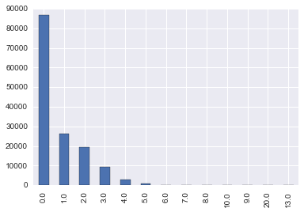
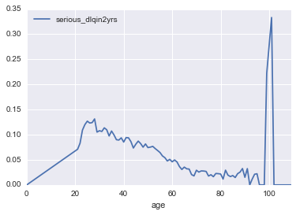
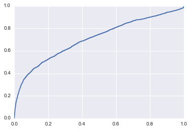

## 数据挖掘概览

### 一、引子：关于数据利用的故事

[林彪发现敌军指挥部](http://news.ifeng.com/history/zhongguojindaishi/detail_2013_03/18/23226701_0.shtml)

在这个故事中，指挥官做了这样几件有关联的事情。一并称之为”数据闭环“。
- 不间断的收集战场数据；
- 基于某个指标抽象出战场实际；
- 对指标进行分析建模，发现一个机会；
- 基于分析结果进行战场决断，获取最大利益。

将指挥官换成CEO，就是商业数据闭环，基本上所有的商业数据应用，离不开这个套路。

你觉得指挥官建立了什么模型？先想想，别急着看[答案](https://zh.wikipedia.org/wiki/%E5%BC%82%E5%B8%B8%E6%A3%80%E6%B5%8B)

### 什么是数据闭环
- 度量商业行动：例如用一个指标测量用户响应率
- 识别商业机会：规划光棍节新产品或新活动，理解客户数据的波动，评价营销活动的结果
- 将数据转为知识：通过数据挖掘实施
- 基于知识行动：通常结合现有的业务流程，客户出现时推送信息，不同客户给予不同的资源

### 数据利用的四层境界
- 数据：
数据底层，原始数据的汪洋大海。形态：数据库。功能：直接取数
- 信息：
基于数据提炼得到的指标，新客有多少？老客有多少？老客都有什么特征，新客都有什么特征？形态：汇总报表。功能：指标提供，回答过去已经发生了什么的问题，业务人员运用得当也可以解决很多问题。
- 知识：
基于信息建立各指标之间的关系模型。什么情况下新客会转化为老客？模型结果。形态：模型，功能：回答为什么的问题，解释关系和因果，预测未来
- 智慧：
将知识融入决策流程，将模型嵌入产品。我们要怎么做，才会让新客转化为老客。形态：数据产品。功能：控制未来

### 数据产品
- 数据产品就是给决策者提供行动信息的载体，例如
	- Amazon的商品推荐
	- 天气预报
	- Stock Market Predictions
	- Production Process Improvements
	- Health Diagnosis
	- Flu Trend Predictions
- 有些看起来也能提供决策者行动信息，如黄历，星相，但它们不是基于数据的洞察。

### 二、什么是数据挖掘
- 数据挖掘也称为知识发现。是一个去粗存精、去伪存真的过程。是从大量数据中提取、归纳有用知识的过程和方法。将其用于决策，可以提高人类的福利。
- [开普勒三大定律](https://zh.wikipedia.org/wiki/%E5%BC%80%E6%99%AE%E5%8B%92%E5%AE%9A%E5%BE%8B)
开普勒的老师第谷收集了大量天文观测数据，但却是开普勒通过研究数据找到背后的规律
- 几个相关概念
    - 机器学习
    - 统计理论
    - 数据科学
    - 模式识别

|  | 需要算法开发 | 不需要算法开发 |
| ------| ------ | ------ |
| 需要数据开发 | 数据科学家 | 数据挖掘工程师 |
| 不需要数据开发 | 算法工程师 | kaggle玩家 |

### 三、数据挖掘和我们的关系

### 为何需要数据挖掘：
 - 如果没有数据，可以用什么决策？（直觉，经验归纳，逻辑推理，算命）
- 需要数据，因为数据就是现实世界的历史痕迹，需要通过各种痕迹来推断未来，数据就是历史，挖掘就是归纳。
- 数据太多，人脑无法直接处理。记录的数据越来越多，形式和来源都越来越复杂。自然产生的数据，人类社会产生的数据（社交网络，文本，图像，语音，视频......）
- 所以需要挖掘工具和方法的帮助。

### 数据挖掘为什么火？
- 当前的各项前提条件已经具备。
    - 硬件价格的下降，使数据的存储和运算成本更低。
    - 个人和创业公司得以进入数据领域。
    - 开源软件工具和公开课分享使跨界更为容易。
    - 不同学科的壁垒被打破，可以较为容易的获得并学习其它学科的知识和工具，成为专业余人士。


### 数据挖掘和谁打交道
- 产品：侧重于底层数据框架搭建，数据报表开发，数据产品开发，例如淘宝的数据魔方的开发工作，这类工作需要很强的软件开发背景。
- 模型：侧重于对数据的研究，用统计理论或机器学习的方法对数据进行分析建模，例如广告的点击率分析建模，这类工作需要丰富的统计理论和模型算法知识。
- 美学：侧重于对数据的创作，用WEB技术进行数据可视化或者制作信息图，例如卫报的数据网站，需要很强的可视化能力和前端技术。
- 价值：侧重于数据中包含的商业价值研究，强调对专业领域的业务理解和交流沟通，例如咨询公司发布的商业分析报告，需要广泛的业务知识和商业敏感度。


### 应用领域有哪些：
- 商业零售
- 医疗
- 金融
- 太空探索
- 文字语音识别
- 下棋。。。


### 四、什么是数据挖掘模型？
- 一个关于模型的浅显例子：如何判断一个未切开的西瓜甜不甜？
- 可能的方案：
	- 准备N个西瓜
	- 设计M个变量或指标（特征工程），重量、花纹、茎叶的新鲜程度、卖家的位置...，切开前记录这些指标，记为X。
	- 切开后让n个人品尝打分(0表示不甜，1表示甜)，记为Y。
	- 使用其中一部分数据，结合分类算法对X和Y的关系进行建模。
	- 用剩下另一部分数据，检查模型的效果。
	- 把模型的逻辑写成一个APP放到应用市场上，持续收获数据，改进模型。

- 一个复杂的例子，如何判断一个老人未来是否会得痴呆症（思考思考）

### 商业中使用模型的例子：
- 银行的信用卡发放：

银行在信用卡发放的时候会进行审核。审核某个人的资格是否符合条件以授信。在传统的审核工作，这种事是人工来做的，申请人填一张表，写上个人的年龄、职业、收入等信息（X变量）。交给有经验的银行风控师，他们来进行评价，是发信用卡，还是不发信用卡。

但在互联网时代，这种人工审核就太慢了。互联网金融的崛起就是最明显的趋势。它将全网中关于个人的行为数据进行收集整合，其中有必然有一部分人已经在金融机构有过借贷行为，考察这种行为是否有违约，将其作为Y。将其它的行为数据作为X。这样就构成了一个可以喂到分类算法中的数据集。然后这个模型就可以用在未来的申请人身上，形成审核自动化系统。

- gmail垃圾邮件自动分类：

如果你点开自己的gmail邮箱，仔细观察会发现一个垃圾邮件的标签，它平时默默的为你挡下大量的垃圾信息，而又不去干扰你，实在是数据产品的典范。那么如果你来做这种垃圾邮件的自动分类，要怎么做的呢？

如果我们考虑简单些，抛开一封电邮中的其它信息（发件人，IP...），而只取文本信息的话，这个问题就转为一个文本分类的问题。

文本的分析难点在于：文本不是给计算机阅读的，它有复杂的语言结构（语法、语义、语用），但语言中依然存在统计规律（统计语言模型）。

一个简单的文本分类模型：判断一封邮件是否垃圾邮件
    - 收集N个邮件
    - 从邮件中提取指标（分词，空间向量模型），构成文档-词项矩阵
	- 人工标注这些邮件是否垃圾邮件
	- 用一部分数据，结合算法对X和Y的关系进行建模。
	- 用剩下的数据，检查模型的效果。

### 五、数据挖掘日常工作有哪些
- 项目讨论和规划，就是开会。这方面工作目的主要是明确业务问题。是不是可以做？大概可以怎么做？确定了业务问题之后，需要将这个业务问题翻译成一个数据问题。

- 项目准备，准备开工干活了。这方面是最为繁琐也最容易出错的地方。需要和数据仓库的同学配合取得必要的数据，探索理解数据的业务意义，评估数据质量，根据项目需要对数据进行整理转换，做大量的特征工程的工作。

- 项目实施，即数据建模，开始拷打数据了。选择尝试不同的模型算法，从数据中得到需要的结果，然后从不同方面评价效果怎么样。

- 项目结束，交付结果。确定模型如何部署，并实施部署工作。这种部署就是模型的应用，多数情况下是将结果回写到数据库中。同时结果交付给需求方，写最终的项目报告，归档所有文件。

- 阅读文献，方法研究。在比较空闲的时间，或者遇到难题的时候，都需要去找巨人的肩膀依靠一下。


### 一个典型的步骤流程
- 商业理解：理解业务目标和需求，并转化为数据挖掘可理解的问题定义。建模师会参加业务组的会议，主要是了解收集业务需求。
- 数据理解：筛选目标数据，检验数据质量，探索数据特征，评估可用数据。建模师会将一些初步结果呈现给业务组，得到进一步反馈。
- 数据准备：通过清洗，集成，变换，归约等处理方法构造最终数据集合。建模师开始疯狂的写SQL类的脚本去洗数据。
- 模型建立：选择和应用各种机器学习或统计方法、构建模型并调校各种参数。建模师进入炼丹阶段，期待能有好的结果。
- 模型评价：结合最初的商业目标评价并解释模型，评估其可能的商业效果。建模师将模型结果和业务团队进行沟通。
- 模型部署：按用户习惯方式实施并发布模型，提供分析结论，并持续跟踪。建模师将模型上线，监测性能。


### 六、数据挖掘的任务模式
- 分类 Classification [Predictive]
- 聚类 Clustering [Descriptive]
- 关联规则 Association Rule Discovery [Descriptive]
- 序列挖掘 Sequential Pattern Discovery [Descriptive]
- 回归 Regression [Predictive]
- 异常检测 Deviation Detection [Predictive]


### 分类方法的应用
### 精准化营销
- 问题: 准备发售iphone新品了，哪些用户可能会买？
- 方法:
  - 找到相似产品的用户行为数据，观察是否购买作为目标变量
  - 收集这些用户的行为特征，作为模型的解释变量

### 聚类方法的应用
### 用户分群:
- 问题: 如何将用户分成若干组，然后针对不同用户组进行营销活动
- 方法:
  - 收集用户的基本社会特征和行为特征
  - 根据用户的相似程度进行聚类分组
  - 根据同组的用户购买行为判断分群的效果


### 关联规则应用

### 相似商品推荐
- 关联规则是一种规律 {面包干, … } --> {薯片}
- 买了面包干的用户往往也会去买薯片，可以利用这种关联规则，将若干商品一起放在货架上捆绑销售
- 不同的关联商品，暗示了不同的消费场景


### 异常检测应用

- 从正常行为中发现不正常的行为模式
- 信用卡欺诈
- 网络入侵


### 七、需要掌握哪些技能
- 有形的技能:
	- 理论：气宗。 例如统计理论、机器学习算法。个人体会精通理论后再做数据工作就如汤泼雪。我也承认学习理论是艰难的，但是一定要在年轻的时候读最难的书。《数学之美》中谈到，技术分为术和道两种，具体的做事方法是术，做事的原理和原则是道，只追求术的人工作很辛苦，只有掌握了道才能永远游刃有余。
	- 工具：剑宗。理论不用在产品上就是王语焉的学院派。从理论到产品，需要掌握各种工具。这类工具用得熟了能事半功倍，例如R、python、SQL、hadoop这类。学习工具和学习语言一样，都要多读多写，模仿揣摩，就可以运用自如。不过迷信工具是没有意义的，没有最好的工具，只有最合适的工具。如果你是独孤求败，可以玩玄铁剑，如果你是东方不败，可以玩绣花针。
	- 经验：实战。有内力有剑法，就需要下山了。对战最强悍的对手，才能让你的内力剑法融为一体。做项目，在工作解决难题，才是长进最快的。

- 无形的气质:
	- 好奇，好奇心和兴趣是从数据中得到洞察的驱动力。有好奇心的人才会对数据有持续的热情。
	- 创造，兵无常势，数据的工作都是千差万别的，虽然可以依靠一些老的经验做些照猫画虎的事。但最好还是需要根据不同的项目情况来做出判断。独立思考和创造让你走得更远。
	- 求败，创造、前沿、探索性的工作，一定会有失败，快速失败，快速学习，不断修正，能够败中求胜。


### 如何培养数据挖掘的技能
- 两个字：自学。 “知识与耐心，是击败强者的唯一方法。”
	- 通过阅读来学习。包括了阅读经典的理论教材、代码、论文、上公开课。
	- 通过牛人来学习。包括同行的聚会、讨论、大牛的博客、微博、twitter、RSS。
	- 通过练习来学习。包括代码练习题、参加kaggle比赛、解决实际工作中的难题。
	- 通过分享来学习。包括自己写笔记、写博客、和同事分享交流、培训新人。


### 八、经验之谈
#### 建模中的坑
- 建模过程的问题
    - 缺乏业务问题的沟通和理解
    - 只关注训练数据或只过于相信数据
    - 只依赖于一种技术
    - 错误的变量输入

- 挖掘结果不真实
    - 模型结果不代表任何规律
    - 模型训练集可能不反映真正的总体
    - 数据的详细程度有误

- 挖掘结果没有用
    - 挖掘结果众所周知
    - 挖掘结果不可用于决策

#### 一点心得
- 提问题比回答问题更重要
    一个具体的业务痛点是数据挖掘的起点，精心计划流程步骤，业务知识贯穿挖掘建模的每个阶段。

- 对数据持谨慎的态度
    数据很可能出错，数据整理占据大部分的工作时间。

-  数据本身仅能用于描述历史
    不能展现因果，也不能预知未来。

- 数据价值体现在落地应用
    数据挖掘价值并不取决于模型的准确或稳定，取决于背后的决策组织。

- 不同的指标和模型都有其适用范围
    随时间环境变化，所有的模式都会改变，不断尝试，不断修正。

- 工作中的文档化和自动化

### 一个综合案例的建模步骤


- 问题定义
- 数据探索
- 特征工程
- 建模和评估


### 问题定义

我们使用kaggle上一个经典的问题做为案例示范，即判断一个贷款者在后续两年内是否会违约的概率。

#### 需要思考的关键问题

- 损失是如何发生的?
- 违约的人有哪些特点?
- 违约的占比有多少？
- 如何能改善我们的损失？

####  数据下载

[http://www.kaggle.com/c/GiveMeSomeCredit](http://www.kaggle.com/c/GiveMeSomeCredit)

### 变量的意义
- SeriousDlqin2yrs
    - 用户在后续两年内出现90天以上的还款逾期，这是目标变量，以下都是解释变量
- RevolvingUtilizationOfUnsecuredLines
    - 信用卡借款占比
- age
    - 借款人年龄
- NumberOfTime30-59DaysPastDueNotWorse
    - 过去有逾期30-59天还款的次数
- DebtRatio
    - 月度生活成本占月收入的比率
- MonthlyIncome
    - 月收入
- NumberOfOpenCreditLinesAndLoans
    - 包括车贷房贷在内的贷款笔数
- NumberOfTimes90DaysLate
    - 过去有逾期90天以上还款的次数
- NumberRealEstateLoansOrLines
    - 房贷的信贷次数
- NumberOfTime60-89DaysPastDueNotWorse
    - 过去有逾期60-89天还款的次数
- NumberOfDependents
    - 家庭中需要抚养者的人数


```python
import pandas as pd
import numpy as np
import seaborn as sns
import matplotlib.pyplot as plt
%matplotlib inline
```


```python
df = pd.read_csv("data/credit-training.csv") #读取数据
df.head()
```


<div>
<table border="1" class="dataframe">
  <thead>
    <tr style="text-align: right;">
      <th></th>
      <th>SeriousDlqin2yrs</th>
      <th>RevolvingUtilizationOfUnsecuredLines</th>
      <th>age</th>
      <th>NumberOfTime30-59DaysPastDueNotWorse</th>
      <th>DebtRatio</th>
      <th>MonthlyIncome</th>
      <th>NumberOfOpenCreditLinesAndLoans</th>
      <th>NumberOfTimes90DaysLate</th>
      <th>NumberRealEstateLoansOrLines</th>
      <th>NumberOfTime60-89DaysPastDueNotWorse</th>
      <th>NumberOfDependents</th>
    </tr>
  </thead>
  <tbody>
    <tr>
      <th>0</th>
      <td>1</td>
      <td>0.766127</td>
      <td>45</td>
      <td>2</td>
      <td>0.802982</td>
      <td>9120.0</td>
      <td>13</td>
      <td>0</td>
      <td>6</td>
      <td>0</td>
      <td>2.0</td>
    </tr>
    <tr>
      <th>1</th>
      <td>0</td>
      <td>0.957151</td>
      <td>40</td>
      <td>0</td>
      <td>0.121876</td>
      <td>2600.0</td>
      <td>4</td>
      <td>0</td>
      <td>0</td>
      <td>0</td>
      <td>1.0</td>
    </tr>
    <tr>
      <th>2</th>
      <td>0</td>
      <td>0.658180</td>
      <td>38</td>
      <td>1</td>
      <td>0.085113</td>
      <td>3042.0</td>
      <td>2</td>
      <td>1</td>
      <td>0</td>
      <td>0</td>
      <td>0.0</td>
    </tr>
    <tr>
      <th>3</th>
      <td>0</td>
      <td>0.233810</td>
      <td>30</td>
      <td>0</td>
      <td>0.036050</td>
      <td>3300.0</td>
      <td>5</td>
      <td>0</td>
      <td>0</td>
      <td>0</td>
      <td>0.0</td>
    </tr>
    <tr>
      <th>4</th>
      <td>0</td>
      <td>0.907239</td>
      <td>49</td>
      <td>1</td>
      <td>0.024926</td>
      <td>63588.0</td>
      <td>7</td>
      <td>0</td>
      <td>1</td>
      <td>0</td>
      <td>0.0</td>
    </tr>
  </tbody>
</table>
</div>


```python
df.shape # 一共15万条记录
```


    (150000, 11)


### 数据探索


```python
df.info() # 有缺失值
```

    <class 'pandas.core.frame.DataFrame'>
    RangeIndex: 150000 entries, 0 to 149999
    Data columns (total 11 columns):
    SeriousDlqin2yrs                        150000 non-null int64
    RevolvingUtilizationOfUnsecuredLines    150000 non-null float64
    age                                     150000 non-null int64
    NumberOfTime30-59DaysPastDueNotWorse    150000 non-null int64
    DebtRatio                               150000 non-null float64
    MonthlyIncome                           120269 non-null float64
    NumberOfOpenCreditLinesAndLoans         150000 non-null int64
    NumberOfTimes90DaysLate                 150000 non-null int64
    NumberRealEstateLoansOrLines            150000 non-null int64
    NumberOfTime60-89DaysPastDueNotWorse    150000 non-null int64
    NumberOfDependents                      146076 non-null float64
    dtypes: float64(4), int64(7)
    memory usage: 12.6 MB


```python
df.describe() # 描述性统计
```


<div>
<table border="1" class="dataframe">
  <thead>
    <tr style="text-align: right;">
      <th></th>
      <th>SeriousDlqin2yrs</th>
      <th>RevolvingUtilizationOfUnsecuredLines</th>
      <th>age</th>
      <th>NumberOfTime30-59DaysPastDueNotWorse</th>
      <th>DebtRatio</th>
      <th>MonthlyIncome</th>
      <th>NumberOfOpenCreditLinesAndLoans</th>
      <th>NumberOfTimes90DaysLate</th>
      <th>NumberRealEstateLoansOrLines</th>
      <th>NumberOfTime60-89DaysPastDueNotWorse</th>
      <th>NumberOfDependents</th>
    </tr>
  </thead>
  <tbody>
    <tr>
      <th>count</th>
      <td>150000.000000</td>
      <td>150000.000000</td>
      <td>150000.000000</td>
      <td>150000.000000</td>
      <td>150000.000000</td>
      <td>1.202690e+05</td>
      <td>150000.000000</td>
      <td>150000.000000</td>
      <td>150000.000000</td>
      <td>150000.000000</td>
      <td>146076.000000</td>
    </tr>
    <tr>
      <th>mean</th>
      <td>0.066840</td>
      <td>6.048438</td>
      <td>52.295207</td>
      <td>0.421033</td>
      <td>353.005076</td>
      <td>6.670221e+03</td>
      <td>8.452760</td>
      <td>0.265973</td>
      <td>1.018240</td>
      <td>0.240387</td>
      <td>0.757222</td>
    </tr>
    <tr>
      <th>std</th>
      <td>0.249746</td>
      <td>249.755371</td>
      <td>14.771866</td>
      <td>4.192781</td>
      <td>2037.818523</td>
      <td>1.438467e+04</td>
      <td>5.145951</td>
      <td>4.169304</td>
      <td>1.129771</td>
      <td>4.155179</td>
      <td>1.115086</td>
    </tr>
    <tr>
      <th>min</th>
      <td>0.000000</td>
      <td>0.000000</td>
      <td>0.000000</td>
      <td>0.000000</td>
      <td>0.000000</td>
      <td>0.000000e+00</td>
      <td>0.000000</td>
      <td>0.000000</td>
      <td>0.000000</td>
      <td>0.000000</td>
      <td>0.000000</td>
    </tr>
    <tr>
      <th>25%</th>
      <td>0.000000</td>
      <td>0.029867</td>
      <td>41.000000</td>
      <td>0.000000</td>
      <td>0.175074</td>
      <td>3.400000e+03</td>
      <td>5.000000</td>
      <td>0.000000</td>
      <td>0.000000</td>
      <td>0.000000</td>
      <td>0.000000</td>
    </tr>
    <tr>
      <th>50%</th>
      <td>0.000000</td>
      <td>0.154181</td>
      <td>52.000000</td>
      <td>0.000000</td>
      <td>0.366508</td>
      <td>5.400000e+03</td>
      <td>8.000000</td>
      <td>0.000000</td>
      <td>1.000000</td>
      <td>0.000000</td>
      <td>0.000000</td>
    </tr>
    <tr>
      <th>75%</th>
      <td>0.000000</td>
      <td>0.559046</td>
      <td>63.000000</td>
      <td>0.000000</td>
      <td>0.868254</td>
      <td>8.249000e+03</td>
      <td>11.000000</td>
      <td>0.000000</td>
      <td>2.000000</td>
      <td>0.000000</td>
      <td>1.000000</td>
    </tr>
    <tr>
      <th>max</th>
      <td>1.000000</td>
      <td>50708.000000</td>
      <td>109.000000</td>
      <td>98.000000</td>
      <td>329664.000000</td>
      <td>3.008750e+06</td>
      <td>58.000000</td>
      <td>98.000000</td>
      <td>54.000000</td>
      <td>98.000000</td>
      <td>20.000000</td>
    </tr>
  </tbody>
</table>
</div>


```python
df.SeriousDlqin2yrs.value_counts()
```


    0    139974
    1     10026
    Name: SeriousDlqin2yrs, dtype: int64


```python
df.SeriousDlqin2yrs.mean() # 平均严重拖欠
```


    0.06684


```python
df.NumberOfDependents.unique() # 受抚养者, 查看有多少取值
```


    array([  2.,   1.,   0.,  nan,   3.,   4.,   5.,   6.,   8.,   7.,  20.,
            10.,   9.,  13.])


```python
df.NumberOfDependents.value_counts()
# 观察频数表，一半都没有, 有的话集中1-3个, 再往上较少
```


    0.0     86902
    1.0     26316
    2.0     19522
    3.0      9483
    4.0      2862
    5.0       746
    6.0       158
    7.0        51
    8.0        24
    10.0        5
    9.0         5
    20.0        1
    13.0        1
    Name: NumberOfDependents, dtype: int64


```python
df.groupby("SeriousDlqin2yrs").mean()
```


<div>
<table border="1" class="dataframe">
  <thead>
    <tr style="text-align: right;">
      <th></th>
      <th>RevolvingUtilizationOfUnsecuredLines</th>
      <th>age</th>
      <th>NumberOfTime30-59DaysPastDueNotWorse</th>
      <th>DebtRatio</th>
      <th>MonthlyIncome</th>
      <th>NumberOfOpenCreditLinesAndLoans</th>
      <th>NumberOfTimes90DaysLate</th>
      <th>NumberRealEstateLoansOrLines</th>
      <th>NumberOfTime60-89DaysPastDueNotWorse</th>
      <th>NumberOfDependents</th>
    </tr>
    <tr>
      <th>SeriousDlqin2yrs</th>
      <th></th>
      <th></th>
      <th></th>
      <th></th>
      <th></th>
      <th></th>
      <th></th>
      <th></th>
      <th></th>
      <th></th>
    </tr>
  </thead>
  <tbody>
    <tr>
      <th>0</th>
      <td>6.168855</td>
      <td>52.751375</td>
      <td>0.280109</td>
      <td>357.151168</td>
      <td>6747.837774</td>
      <td>8.493620</td>
      <td>0.135225</td>
      <td>1.020368</td>
      <td>0.126666</td>
      <td>0.743417</td>
    </tr>
    <tr>
      <th>1</th>
      <td>4.367282</td>
      <td>45.926591</td>
      <td>2.388490</td>
      <td>295.121066</td>
      <td>5630.826493</td>
      <td>7.882306</td>
      <td>2.091362</td>
      <td>0.988530</td>
      <td>1.828047</td>
      <td>0.948208</td>
    </tr>
  </tbody>
</table>
</div>


```python
pd.value_counts(df.NumberOfDependents).plot(kind='bar');
```





```python
pd.crosstab(df.NumberOfTimes90DaysLate, df.SeriousDlqin2yrs)
# 计算交叉频数表
```


<div>
<table border="1" class="dataframe">
  <thead>
    <tr style="text-align: right;">
      <th>SeriousDlqin2yrs</th>
      <th>0</th>
      <th>1</th>
    </tr>
    <tr>
      <th>NumberOfTimes90DaysLate</th>
      <th></th>
      <th></th>
    </tr>
  </thead>
  <tbody>
    <tr>
      <th>0</th>
      <td>135108</td>
      <td>6554</td>
    </tr>
    <tr>
      <th>1</th>
      <td>3478</td>
      <td>1765</td>
    </tr>
    <tr>
      <th>2</th>
      <td>779</td>
      <td>776</td>
    </tr>
    <tr>
      <th>3</th>
      <td>282</td>
      <td>385</td>
    </tr>
    <tr>
      <th>4</th>
      <td>96</td>
      <td>195</td>
    </tr>
    <tr>
      <th>5</th>
      <td>48</td>
      <td>83</td>
    </tr>
    <tr>
      <th>6</th>
      <td>32</td>
      <td>48</td>
    </tr>
    <tr>
      <th>7</th>
      <td>7</td>
      <td>31</td>
    </tr>
    <tr>
      <th>8</th>
      <td>6</td>
      <td>15</td>
    </tr>
    <tr>
      <th>9</th>
      <td>5</td>
      <td>14</td>
    </tr>
    <tr>
      <th>10</th>
      <td>3</td>
      <td>5</td>
    </tr>
    <tr>
      <th>11</th>
      <td>2</td>
      <td>3</td>
    </tr>
    <tr>
      <th>12</th>
      <td>1</td>
      <td>1</td>
    </tr>
    <tr>
      <th>13</th>
      <td>2</td>
      <td>2</td>
    </tr>
    <tr>
      <th>14</th>
      <td>1</td>
      <td>1</td>
    </tr>
    <tr>
      <th>15</th>
      <td>2</td>
      <td>0</td>
    </tr>
    <tr>
      <th>17</th>
      <td>0</td>
      <td>1</td>
    </tr>
    <tr>
      <th>96</th>
      <td>1</td>
      <td>4</td>
    </tr>
    <tr>
      <th>98</th>
      <td>121</td>
      <td>143</td>
    </tr>
  </tbody>
</table>
</div>


```python
pd.crosstab(df.age, df.NumberOfDependents)
# 年龄与受抚养者的关系
# 岁数越大抚养者会多
```


<div>
<table border="1" class="dataframe">
  <thead>
    <tr style="text-align: right;">
      <th>NumberOfDependents</th>
      <th>0.0</th>
      <th>1.0</th>
      <th>2.0</th>
      <th>3.0</th>
      <th>4.0</th>
      <th>5.0</th>
      <th>6.0</th>
      <th>7.0</th>
      <th>8.0</th>
      <th>9.0</th>
      <th>10.0</th>
      <th>13.0</th>
      <th>20.0</th>
    </tr>
    <tr>
      <th>age</th>
      <th></th>
      <th></th>
      <th></th>
      <th></th>
      <th></th>
      <th></th>
      <th></th>
      <th></th>
      <th></th>
      <th></th>
      <th></th>
      <th></th>
      <th></th>
    </tr>
  </thead>
  <tbody>
    <tr>
      <th>0</th>
      <td>0</td>
      <td>0</td>
      <td>1</td>
      <td>0</td>
      <td>0</td>
      <td>0</td>
      <td>0</td>
      <td>0</td>
      <td>0</td>
      <td>0</td>
      <td>0</td>
      <td>0</td>
      <td>0</td>
    </tr>
    <tr>
      <th>21</th>
      <td>148</td>
      <td>3</td>
      <td>1</td>
      <td>0</td>
      <td>0</td>
      <td>0</td>
      <td>0</td>
      <td>0</td>
      <td>0</td>
      <td>0</td>
      <td>0</td>
      <td>0</td>
      <td>0</td>
    </tr>
    <tr>
      <th>22</th>
      <td>385</td>
      <td>7</td>
      <td>2</td>
      <td>2</td>
      <td>0</td>
      <td>0</td>
      <td>0</td>
      <td>0</td>
      <td>0</td>
      <td>0</td>
      <td>0</td>
      <td>0</td>
      <td>0</td>
    </tr>
    <tr>
      <th>23</th>
      <td>550</td>
      <td>33</td>
      <td>13</td>
      <td>3</td>
      <td>0</td>
      <td>0</td>
      <td>0</td>
      <td>0</td>
      <td>0</td>
      <td>0</td>
      <td>0</td>
      <td>0</td>
      <td>0</td>
    </tr>
    <tr>
      <th>24</th>
      <td>689</td>
      <td>48</td>
      <td>19</td>
      <td>3</td>
      <td>1</td>
      <td>0</td>
      <td>0</td>
      <td>0</td>
      <td>0</td>
      <td>0</td>
      <td>0</td>
      <td>0</td>
      <td>0</td>
    </tr>
    <tr>
      <th>25</th>
      <td>774</td>
      <td>91</td>
      <td>31</td>
      <td>7</td>
      <td>5</td>
      <td>1</td>
      <td>0</td>
      <td>0</td>
      <td>0</td>
      <td>0</td>
      <td>0</td>
      <td>0</td>
      <td>0</td>
    </tr>
    <tr>
      <th>26</th>
      <td>946</td>
      <td>128</td>
      <td>56</td>
      <td>14</td>
      <td>4</td>
      <td>0</td>
      <td>0</td>
      <td>0</td>
      <td>0</td>
      <td>0</td>
      <td>0</td>
      <td>0</td>
      <td>0</td>
    </tr>
    <tr>
      <th>27</th>
      <td>1001</td>
      <td>192</td>
      <td>53</td>
      <td>32</td>
      <td>4</td>
      <td>0</td>
      <td>0</td>
      <td>0</td>
      <td>0</td>
      <td>0</td>
      <td>0</td>
      <td>0</td>
      <td>0</td>
    </tr>
    <tr>
      <th>28</th>
      <td>1142</td>
      <td>210</td>
      <td>114</td>
      <td>45</td>
      <td>8</td>
      <td>1</td>
      <td>0</td>
      <td>0</td>
      <td>0</td>
      <td>0</td>
      <td>0</td>
      <td>0</td>
      <td>0</td>
    </tr>
    <tr>
      <th>29</th>
      <td>1195</td>
      <td>254</td>
      <td>145</td>
      <td>53</td>
      <td>14</td>
      <td>1</td>
      <td>1</td>
      <td>0</td>
      <td>0</td>
      <td>0</td>
      <td>0</td>
      <td>0</td>
      <td>0</td>
    </tr>
    <tr>
      <th>30</th>
      <td>1337</td>
      <td>288</td>
      <td>178</td>
      <td>72</td>
      <td>14</td>
      <td>7</td>
      <td>1</td>
      <td>1</td>
      <td>0</td>
      <td>0</td>
      <td>0</td>
      <td>0</td>
      <td>0</td>
    </tr>
    <tr>
      <th>31</th>
      <td>1314</td>
      <td>344</td>
      <td>245</td>
      <td>91</td>
      <td>18</td>
      <td>4</td>
      <td>0</td>
      <td>0</td>
      <td>0</td>
      <td>0</td>
      <td>0</td>
      <td>0</td>
      <td>0</td>
    </tr>
    <tr>
      <th>32</th>
      <td>1207</td>
      <td>380</td>
      <td>275</td>
      <td>106</td>
      <td>53</td>
      <td>3</td>
      <td>0</td>
      <td>0</td>
      <td>0</td>
      <td>0</td>
      <td>0</td>
      <td>0</td>
      <td>0</td>
    </tr>
    <tr>
      <th>33</th>
      <td>1254</td>
      <td>449</td>
      <td>315</td>
      <td>140</td>
      <td>50</td>
      <td>10</td>
      <td>2</td>
      <td>0</td>
      <td>0</td>
      <td>0</td>
      <td>0</td>
      <td>0</td>
      <td>0</td>
    </tr>
    <tr>
      <th>34</th>
      <td>1152</td>
      <td>389</td>
      <td>360</td>
      <td>145</td>
      <td>65</td>
      <td>11</td>
      <td>1</td>
      <td>0</td>
      <td>0</td>
      <td>0</td>
      <td>0</td>
      <td>0</td>
      <td>0</td>
    </tr>
    <tr>
      <th>35</th>
      <td>1136</td>
      <td>418</td>
      <td>398</td>
      <td>184</td>
      <td>58</td>
      <td>15</td>
      <td>3</td>
      <td>1</td>
      <td>1</td>
      <td>0</td>
      <td>0</td>
      <td>0</td>
      <td>0</td>
    </tr>
    <tr>
      <th>36</th>
      <td>1139</td>
      <td>445</td>
      <td>486</td>
      <td>202</td>
      <td>50</td>
      <td>15</td>
      <td>5</td>
      <td>1</td>
      <td>0</td>
      <td>0</td>
      <td>0</td>
      <td>0</td>
      <td>0</td>
    </tr>
    <tr>
      <th>37</th>
      <td>1088</td>
      <td>488</td>
      <td>541</td>
      <td>274</td>
      <td>77</td>
      <td>18</td>
      <td>2</td>
      <td>0</td>
      <td>0</td>
      <td>1</td>
      <td>0</td>
      <td>0</td>
      <td>0</td>
    </tr>
    <tr>
      <th>38</th>
      <td>1113</td>
      <td>484</td>
      <td>604</td>
      <td>283</td>
      <td>84</td>
      <td>26</td>
      <td>3</td>
      <td>0</td>
      <td>1</td>
      <td>1</td>
      <td>0</td>
      <td>0</td>
      <td>0</td>
    </tr>
    <tr>
      <th>39</th>
      <td>1202</td>
      <td>544</td>
      <td>691</td>
      <td>383</td>
      <td>111</td>
      <td>27</td>
      <td>4</td>
      <td>1</td>
      <td>1</td>
      <td>0</td>
      <td>1</td>
      <td>0</td>
      <td>0</td>
    </tr>
    <tr>
      <th>40</th>
      <td>1185</td>
      <td>570</td>
      <td>758</td>
      <td>391</td>
      <td>104</td>
      <td>43</td>
      <td>5</td>
      <td>1</td>
      <td>1</td>
      <td>0</td>
      <td>0</td>
      <td>0</td>
      <td>1</td>
    </tr>
    <tr>
      <th>41</th>
      <td>1193</td>
      <td>517</td>
      <td>791</td>
      <td>445</td>
      <td>113</td>
      <td>30</td>
      <td>4</td>
      <td>0</td>
      <td>1</td>
      <td>0</td>
      <td>0</td>
      <td>0</td>
      <td>0</td>
    </tr>
    <tr>
      <th>42</th>
      <td>1159</td>
      <td>526</td>
      <td>755</td>
      <td>427</td>
      <td>142</td>
      <td>38</td>
      <td>7</td>
      <td>2</td>
      <td>0</td>
      <td>0</td>
      <td>0</td>
      <td>0</td>
      <td>0</td>
    </tr>
    <tr>
      <th>43</th>
      <td>1205</td>
      <td>556</td>
      <td>789</td>
      <td>431</td>
      <td>156</td>
      <td>33</td>
      <td>9</td>
      <td>4</td>
      <td>1</td>
      <td>0</td>
      <td>1</td>
      <td>0</td>
      <td>0</td>
    </tr>
    <tr>
      <th>44</th>
      <td>1209</td>
      <td>574</td>
      <td>854</td>
      <td>461</td>
      <td>133</td>
      <td>32</td>
      <td>7</td>
      <td>2</td>
      <td>1</td>
      <td>0</td>
      <td>1</td>
      <td>0</td>
      <td>0</td>
    </tr>
    <tr>
      <th>45</th>
      <td>1363</td>
      <td>608</td>
      <td>828</td>
      <td>457</td>
      <td>165</td>
      <td>35</td>
      <td>11</td>
      <td>3</td>
      <td>0</td>
      <td>0</td>
      <td>0</td>
      <td>0</td>
      <td>0</td>
    </tr>
    <tr>
      <th>46</th>
      <td>1373</td>
      <td>695</td>
      <td>876</td>
      <td>498</td>
      <td>165</td>
      <td>35</td>
      <td>8</td>
      <td>8</td>
      <td>2</td>
      <td>0</td>
      <td>0</td>
      <td>0</td>
      <td>0</td>
    </tr>
    <tr>
      <th>47</th>
      <td>1439</td>
      <td>672</td>
      <td>863</td>
      <td>491</td>
      <td>148</td>
      <td>46</td>
      <td>9</td>
      <td>0</td>
      <td>2</td>
      <td>0</td>
      <td>1</td>
      <td>0</td>
      <td>0</td>
    </tr>
    <tr>
      <th>48</th>
      <td>1509</td>
      <td>771</td>
      <td>791</td>
      <td>459</td>
      <td>157</td>
      <td>37</td>
      <td>11</td>
      <td>3</td>
      <td>1</td>
      <td>2</td>
      <td>0</td>
      <td>0</td>
      <td>0</td>
    </tr>
    <tr>
      <th>49</th>
      <td>1632</td>
      <td>717</td>
      <td>790</td>
      <td>439</td>
      <td>143</td>
      <td>46</td>
      <td>8</td>
      <td>6</td>
      <td>1</td>
      <td>0</td>
      <td>0</td>
      <td>0</td>
      <td>0</td>
    </tr>
    <tr>
      <th>...</th>
      <td>...</td>
      <td>...</td>
      <td>...</td>
      <td>...</td>
      <td>...</td>
      <td>...</td>
      <td>...</td>
      <td>...</td>
      <td>...</td>
      <td>...</td>
      <td>...</td>
      <td>...</td>
      <td>...</td>
    </tr>
    <tr>
      <th>74</th>
      <td>1164</td>
      <td>184</td>
      <td>23</td>
      <td>4</td>
      <td>2</td>
      <td>0</td>
      <td>0</td>
      <td>1</td>
      <td>1</td>
      <td>0</td>
      <td>0</td>
      <td>0</td>
      <td>0</td>
    </tr>
    <tr>
      <th>75</th>
      <td>981</td>
      <td>167</td>
      <td>17</td>
      <td>3</td>
      <td>0</td>
      <td>0</td>
      <td>0</td>
      <td>0</td>
      <td>0</td>
      <td>0</td>
      <td>0</td>
      <td>0</td>
      <td>0</td>
    </tr>
    <tr>
      <th>76</th>
      <td>933</td>
      <td>165</td>
      <td>16</td>
      <td>0</td>
      <td>0</td>
      <td>0</td>
      <td>0</td>
      <td>0</td>
      <td>0</td>
      <td>0</td>
      <td>0</td>
      <td>0</td>
      <td>0</td>
    </tr>
    <tr>
      <th>77</th>
      <td>890</td>
      <td>129</td>
      <td>11</td>
      <td>2</td>
      <td>0</td>
      <td>0</td>
      <td>0</td>
      <td>0</td>
      <td>0</td>
      <td>0</td>
      <td>0</td>
      <td>0</td>
      <td>0</td>
    </tr>
    <tr>
      <th>78</th>
      <td>837</td>
      <td>137</td>
      <td>13</td>
      <td>2</td>
      <td>1</td>
      <td>0</td>
      <td>0</td>
      <td>0</td>
      <td>0</td>
      <td>0</td>
      <td>0</td>
      <td>0</td>
      <td>0</td>
    </tr>
    <tr>
      <th>79</th>
      <td>770</td>
      <td>131</td>
      <td>10</td>
      <td>4</td>
      <td>0</td>
      <td>0</td>
      <td>0</td>
      <td>0</td>
      <td>0</td>
      <td>0</td>
      <td>0</td>
      <td>0</td>
      <td>0</td>
    </tr>
    <tr>
      <th>80</th>
      <td>704</td>
      <td>109</td>
      <td>7</td>
      <td>2</td>
      <td>0</td>
      <td>0</td>
      <td>0</td>
      <td>0</td>
      <td>0</td>
      <td>0</td>
      <td>0</td>
      <td>0</td>
      <td>0</td>
    </tr>
    <tr>
      <th>81</th>
      <td>629</td>
      <td>76</td>
      <td>6</td>
      <td>1</td>
      <td>0</td>
      <td>0</td>
      <td>0</td>
      <td>0</td>
      <td>0</td>
      <td>0</td>
      <td>0</td>
      <td>0</td>
      <td>0</td>
    </tr>
    <tr>
      <th>82</th>
      <td>527</td>
      <td>69</td>
      <td>1</td>
      <td>0</td>
      <td>1</td>
      <td>0</td>
      <td>0</td>
      <td>0</td>
      <td>0</td>
      <td>0</td>
      <td>0</td>
      <td>0</td>
      <td>0</td>
    </tr>
    <tr>
      <th>83</th>
      <td>417</td>
      <td>44</td>
      <td>2</td>
      <td>0</td>
      <td>0</td>
      <td>0</td>
      <td>0</td>
      <td>0</td>
      <td>0</td>
      <td>0</td>
      <td>0</td>
      <td>0</td>
      <td>0</td>
    </tr>
    <tr>
      <th>84</th>
      <td>406</td>
      <td>32</td>
      <td>1</td>
      <td>0</td>
      <td>0</td>
      <td>0</td>
      <td>0</td>
      <td>0</td>
      <td>0</td>
      <td>0</td>
      <td>0</td>
      <td>0</td>
      <td>0</td>
    </tr>
    <tr>
      <th>85</th>
      <td>403</td>
      <td>30</td>
      <td>2</td>
      <td>0</td>
      <td>0</td>
      <td>0</td>
      <td>0</td>
      <td>0</td>
      <td>0</td>
      <td>0</td>
      <td>0</td>
      <td>0</td>
      <td>0</td>
    </tr>
    <tr>
      <th>86</th>
      <td>318</td>
      <td>46</td>
      <td>2</td>
      <td>0</td>
      <td>1</td>
      <td>0</td>
      <td>0</td>
      <td>0</td>
      <td>0</td>
      <td>0</td>
      <td>0</td>
      <td>0</td>
      <td>0</td>
    </tr>
    <tr>
      <th>87</th>
      <td>279</td>
      <td>29</td>
      <td>1</td>
      <td>1</td>
      <td>0</td>
      <td>0</td>
      <td>0</td>
      <td>0</td>
      <td>0</td>
      <td>0</td>
      <td>0</td>
      <td>0</td>
      <td>0</td>
    </tr>
    <tr>
      <th>88</th>
      <td>244</td>
      <td>20</td>
      <td>1</td>
      <td>0</td>
      <td>0</td>
      <td>0</td>
      <td>0</td>
      <td>0</td>
      <td>0</td>
      <td>0</td>
      <td>0</td>
      <td>0</td>
      <td>0</td>
    </tr>
    <tr>
      <th>89</th>
      <td>230</td>
      <td>11</td>
      <td>1</td>
      <td>0</td>
      <td>0</td>
      <td>0</td>
      <td>0</td>
      <td>0</td>
      <td>0</td>
      <td>0</td>
      <td>0</td>
      <td>0</td>
      <td>0</td>
    </tr>
    <tr>
      <th>90</th>
      <td>148</td>
      <td>19</td>
      <td>0</td>
      <td>0</td>
      <td>0</td>
      <td>0</td>
      <td>0</td>
      <td>0</td>
      <td>0</td>
      <td>0</td>
      <td>0</td>
      <td>0</td>
      <td>0</td>
    </tr>
    <tr>
      <th>91</th>
      <td>119</td>
      <td>10</td>
      <td>0</td>
      <td>0</td>
      <td>0</td>
      <td>0</td>
      <td>0</td>
      <td>0</td>
      <td>0</td>
      <td>0</td>
      <td>0</td>
      <td>0</td>
      <td>0</td>
    </tr>
    <tr>
      <th>92</th>
      <td>75</td>
      <td>7</td>
      <td>0</td>
      <td>0</td>
      <td>0</td>
      <td>0</td>
      <td>0</td>
      <td>0</td>
      <td>0</td>
      <td>0</td>
      <td>0</td>
      <td>0</td>
      <td>0</td>
    </tr>
    <tr>
      <th>93</th>
      <td>67</td>
      <td>3</td>
      <td>0</td>
      <td>0</td>
      <td>0</td>
      <td>0</td>
      <td>0</td>
      <td>0</td>
      <td>0</td>
      <td>0</td>
      <td>0</td>
      <td>0</td>
      <td>0</td>
    </tr>
    <tr>
      <th>94</th>
      <td>33</td>
      <td>2</td>
      <td>0</td>
      <td>0</td>
      <td>0</td>
      <td>0</td>
      <td>0</td>
      <td>0</td>
      <td>0</td>
      <td>0</td>
      <td>0</td>
      <td>0</td>
      <td>0</td>
    </tr>
    <tr>
      <th>95</th>
      <td>33</td>
      <td>4</td>
      <td>0</td>
      <td>0</td>
      <td>0</td>
      <td>0</td>
      <td>0</td>
      <td>0</td>
      <td>0</td>
      <td>0</td>
      <td>0</td>
      <td>0</td>
      <td>0</td>
    </tr>
    <tr>
      <th>96</th>
      <td>12</td>
      <td>2</td>
      <td>0</td>
      <td>0</td>
      <td>0</td>
      <td>0</td>
      <td>0</td>
      <td>0</td>
      <td>0</td>
      <td>0</td>
      <td>0</td>
      <td>0</td>
      <td>0</td>
    </tr>
    <tr>
      <th>97</th>
      <td>11</td>
      <td>1</td>
      <td>0</td>
      <td>0</td>
      <td>0</td>
      <td>0</td>
      <td>0</td>
      <td>0</td>
      <td>0</td>
      <td>0</td>
      <td>0</td>
      <td>0</td>
      <td>0</td>
    </tr>
    <tr>
      <th>98</th>
      <td>5</td>
      <td>0</td>
      <td>0</td>
      <td>0</td>
      <td>0</td>
      <td>0</td>
      <td>0</td>
      <td>0</td>
      <td>0</td>
      <td>0</td>
      <td>0</td>
      <td>0</td>
      <td>0</td>
    </tr>
    <tr>
      <th>99</th>
      <td>5</td>
      <td>0</td>
      <td>0</td>
      <td>0</td>
      <td>0</td>
      <td>0</td>
      <td>0</td>
      <td>0</td>
      <td>0</td>
      <td>0</td>
      <td>0</td>
      <td>0</td>
      <td>0</td>
    </tr>
    <tr>
      <th>101</th>
      <td>3</td>
      <td>0</td>
      <td>0</td>
      <td>0</td>
      <td>0</td>
      <td>0</td>
      <td>0</td>
      <td>0</td>
      <td>0</td>
      <td>0</td>
      <td>0</td>
      <td>0</td>
      <td>0</td>
    </tr>
    <tr>
      <th>102</th>
      <td>2</td>
      <td>1</td>
      <td>0</td>
      <td>0</td>
      <td>0</td>
      <td>0</td>
      <td>0</td>
      <td>0</td>
      <td>0</td>
      <td>0</td>
      <td>0</td>
      <td>0</td>
      <td>0</td>
    </tr>
    <tr>
      <th>103</th>
      <td>3</td>
      <td>0</td>
      <td>0</td>
      <td>0</td>
      <td>0</td>
      <td>0</td>
      <td>0</td>
      <td>0</td>
      <td>0</td>
      <td>0</td>
      <td>0</td>
      <td>0</td>
      <td>0</td>
    </tr>
    <tr>
      <th>107</th>
      <td>1</td>
      <td>0</td>
      <td>0</td>
      <td>0</td>
      <td>0</td>
      <td>0</td>
      <td>0</td>
      <td>0</td>
      <td>0</td>
      <td>0</td>
      <td>0</td>
      <td>0</td>
      <td>0</td>
    </tr>
  </tbody>
</table>
<p>84 rows × 13 columns</p>
</div>


### 清洗数据


```python
import re
# 将名字都改为 snake_case
def camel_to_snake(column_name):
    """
    converts a string that is camelCase into snake_case
    """
    s1 = re.sub('(.)([A-Z][a-z]+)', r'\1_\2', column_name)
    return re.sub('([a-z0-9])([A-Z])', r'\1_\2', s1).lower()
camel_to_snake("javaLovesCamelCase")
```


    'java_loves_camel_case'


```python
df.columns = [camel_to_snake(col) for col in df.columns]
df.columns.tolist()
```


    ['serious_dlqin2yrs',
     'revolving_utilization_of_unsecured_lines',
     'age',
     'number_of_time30-59_days_past_due_not_worse',
     'debt_ratio',
     'monthly_income',
     'number_of_open_credit_lines_and_loans',
     'number_of_times90_days_late',
     'number_real_estate_loans_or_lines',
     'number_of_time60-89_days_past_due_not_worse',
     'number_of_dependents']


```python
from sklearn.neighbors import KNeighborsRegressor
income_imputer = KNeighborsRegressor(n_neighbors=1)

# 数据分为两部分，有缺失的和无缺失的，用无缺失的数据建立模型来判断缺失数据的可能取值
train_w_monthly_income = df[df.monthly_income.isnull()==False]
train_w_null_monthly_income = df[df.monthly_income.isnull()==True]
```


```python
cols = ['number_real_estate_loans_or_lines', 'number_of_open_credit_lines_and_loans']
income_imputer.fit(train_w_monthly_income[cols], train_w_monthly_income.monthly_income)
# 用房产贷款次数以及未结束贷款次数来训练月收入
```


    KNeighborsRegressor(algorithm='auto', leaf_size=30, metric='minkowski',
              metric_params=None, n_jobs=1, n_neighbors=1, p=2,
              weights='uniform')


```python
new_values = income_imputer.predict(train_w_null_monthly_income[cols])
# 再用模型预测缺失值中的月收入
```


```python
train_w_null_monthly_income.ix[:,'monthly_income']=new_values
# imputation
```


```python
df_imputed = train_w_monthly_income.append(train_w_null_monthly_income)
df_imputed.shape # 填充缺失值 done
```


    (150000, 11)


```python
df_imputed.ix[df_imputed.number_of_dependents.isnull(),'number_of_dependents'] = -1
```


```python
df_imputed.info()
```

    <class 'pandas.core.frame.DataFrame'>
    Int64Index: 150000 entries, 0 to 149997
    Data columns (total 11 columns):
    serious_dlqin2yrs                              150000 non-null int64
    revolving_utilization_of_unsecured_lines       150000 non-null float64
    age                                            150000 non-null int64
    number_of_time30-59_days_past_due_not_worse    150000 non-null int64
    debt_ratio                                     150000 non-null float64
    monthly_income                                 150000 non-null float64
    number_of_open_credit_lines_and_loans          150000 non-null int64
    number_of_times90_days_late                    150000 non-null int64
    number_real_estate_loans_or_lines              150000 non-null int64
    number_of_time60-89_days_past_due_not_worse    150000 non-null int64
    number_of_dependents                           150000 non-null float64
    dtypes: float64(4), int64(7)
    memory usage: 13.7 MB


### 特征工程


```python
df_imputed.monthly_income.hist();
```


```python
def cap_values(x, cap):
    if x > cap:
        return cap
    else:
        return x
# 设定上限
df_imputed.monthly_income = df_imputed.monthly_income.apply(lambda x: cap_values(x, 15000))
```


```python
# 变量离散化，分为15个bin
df_imputed['income_bins'] = pd.cut(df_imputed.monthly_income, bins=15, labels=False)
pd.value_counts(df_imputed.income_bins)
```


    3     23168
    4     19944
    5     15583
    6     14475
    2     14038
    7     10766
    8      8609
    14     7775
    9      7672
    1      7504
    10     6298
    0      4994
    11     4454
    12     2547
    13     2173
    Name: income_bins, dtype: int64


```python
df_imputed[["income_bins", "serious_dlqin2yrs"]].groupby("income_bins").mean()
# 每个月收入分类中统计default平均频数
```


<div>
<table border="1" class="dataframe">
  <thead>
    <tr style="text-align: right;">
      <th></th>
      <th>serious_dlqin2yrs</th>
    </tr>
    <tr>
      <th>income_bins</th>
      <th></th>
    </tr>
  </thead>
  <tbody>
    <tr>
      <th>0</th>
      <td>0.051862</td>
    </tr>
    <tr>
      <th>1</th>
      <td>0.104211</td>
    </tr>
    <tr>
      <th>2</th>
      <td>0.093674</td>
    </tr>
    <tr>
      <th>3</th>
      <td>0.084168</td>
    </tr>
    <tr>
      <th>4</th>
      <td>0.073305</td>
    </tr>
    <tr>
      <th>5</th>
      <td>0.066033</td>
    </tr>
    <tr>
      <th>6</th>
      <td>0.059067</td>
    </tr>
    <tr>
      <th>7</th>
      <td>0.054338</td>
    </tr>
    <tr>
      <th>8</th>
      <td>0.050877</td>
    </tr>
    <tr>
      <th>9</th>
      <td>0.048488</td>
    </tr>
    <tr>
      <th>10</th>
      <td>0.039695</td>
    </tr>
    <tr>
      <th>11</th>
      <td>0.037270</td>
    </tr>
    <tr>
      <th>12</th>
      <td>0.040832</td>
    </tr>
    <tr>
      <th>13</th>
      <td>0.042338</td>
    </tr>
    <tr>
      <th>14</th>
      <td>0.047203</td>
    </tr>
  </tbody>
</table>
</div>


```python
# 画出图来, 可以明显发现在1-2个 bin中的 default 最多
cols = ["income_bins", "serious_dlqin2yrs"]
df_imputed[cols].groupby("income_bins").mean().plot();
```


```python
# 以年龄来看是20-30岁最高, 另外就是100岁前后, 可能是去世了?
cols = ['age', 'serious_dlqin2yrs']
age_means = df_imputed[cols].groupby("age").mean()
age_means.plot();
```





```python
mybins = [0] + range(20, 80, 5) + [120]
df_imputed['age_bin'] = pd.cut(df_imputed.age, bins=mybins)
pd.value_counts(df_imputed['age_bin'])
```


    (45, 50]     18829
    (50, 55]     17861
    (55, 60]     16945
    (60, 65]     16461
    (40, 45]     16208
    (35, 40]     13611
    (65, 70]     10963
    (30, 35]     10728
    (75, 120]    10129
    (25, 30]      7730
    (70, 75]      7507
    (20, 25]      3027
    (0, 20]          0
    dtype: int64


```python
from sklearn.preprocessing import StandardScaler
# Standardize features by removing the mean and scaling to unit variance

# 将月收入标准化
df_imputed['monthly_income_scaled'] = StandardScaler().fit_transform(df_imputed.monthly_income.reshape(-1,1))
```

### 建模和评估


```python
df_imputed.columns
```


    Index([u'serious_dlqin2yrs', u'revolving_utilization_of_unsecured_lines',
           u'age', u'number_of_time30-59_days_past_due_not_worse', u'debt_ratio',
           u'monthly_income', u'number_of_open_credit_lines_and_loans',
           u'number_of_times90_days_late', u'number_real_estate_loans_or_lines',
           u'number_of_time60-89_days_past_due_not_worse', u'number_of_dependents',
           u'income_bins', u'age_bin', u'monthly_income_scaled'],
          dtype='object')


```python
# 特征
features = ['revolving_utilization_of_unsecured_lines',
 'age',
 'number_of_time30-59_days_past_due_not_worse',
 'debt_ratio',
 'monthly_income',
 'number_of_open_credit_lines_and_loans',
 'number_of_times90_days_late',
 'number_real_estate_loans_or_lines',
 'number_of_time60-89_days_past_due_not_worse',
 'number_of_dependents',
 'income_bins',
 'age_bin',
 'monthly_income_scaled']
```


```python
X = pd.get_dummies(df_imputed[features], columns = ['income_bins', 'age_bin'])
# dummy var
```


```python
print X.columns.tolist()
print X.shape
```

    ['revolving_utilization_of_unsecured_lines', 'age', 'number_of_time30-59_days_past_due_not_worse', 'debt_ratio', 'monthly_income', 'number_of_open_credit_lines_and_loans', 'number_of_times90_days_late', 'number_real_estate_loans_or_lines', 'number_of_time60-89_days_past_due_not_worse', 'number_of_dependents', 'monthly_income_scaled', 'income_bins_0', 'income_bins_1', 'income_bins_2', 'income_bins_3', 'income_bins_4', 'income_bins_5', 'income_bins_6', 'income_bins_7', 'income_bins_8', 'income_bins_9', 'income_bins_10', 'income_bins_11', 'income_bins_12', 'income_bins_13', 'income_bins_14', 'age_bin_(0, 20]', 'age_bin_(20, 25]', 'age_bin_(25, 30]', 'age_bin_(30, 35]', 'age_bin_(35, 40]', 'age_bin_(40, 45]', 'age_bin_(45, 50]', 'age_bin_(50, 55]', 'age_bin_(55, 60]', 'age_bin_(60, 65]', 'age_bin_(65, 70]', 'age_bin_(70, 75]', 'age_bin_(75, 120]']
    (150000, 39)


```python
y = df_imputed.serious_dlqin2yrs # target
```


```python
from sklearn.cross_validation import train_test_split
train_X, test_X, train_y, test_y = train_test_split(X, y ,train_size=0.7,random_state=1)
# 70% 是 train data
```


```python
print train_X.shape
print test_X.shape
```

    (105000, 39)
    (45000, 39)


```python
from sklearn.linear_model import LogisticRegression
from sklearn.ensemble import RandomForestClassifier, GradientBoostingClassifier
```


```python
clf = LogisticRegression() # logit 逻辑回归
clf.fit(train_X,train_y)
```


    LogisticRegression(C=1.0, class_weight=None, dual=False, fit_intercept=True,
              intercept_scaling=1, max_iter=100, multi_class='ovr', n_jobs=1,
              penalty='l2', random_state=None, solver='liblinear', tol=0.0001,
              verbose=0, warm_start=False)


```python
clf.predict_proba(test_X) # 预测概率
```


    array([[ 0.92834155,  0.07165845],
           [ 0.96492419,  0.03507581],
           [ 0.95753197,  0.04246803],
           ...,
           [ 0.96021551,  0.03978449],
           [ 0.87166534,  0.12833466],
           [ 0.9777555 ,  0.0222445 ]])


```python
from sklearn.metrics import roc_curve, roc_auc_score, classification_report, confusion_matrix
# 评价方法
```


```python
preds = clf.predict(test_X)
confusion_matrix(test_y, preds)
```


    array([[41880,    88],
           [ 2908,   124]])


```python
print classification_report(test_y, preds, labels=[0, 1])
```

                 precision    recall  f1-score   support

              0       0.94      1.00      0.97     41968
              1       0.58      0.04      0.08      3032

    avg / total       0.91      0.93      0.91     45000


```python
pre = clf.predict_proba(test_X)
roc_auc_score(test_y,pre[:,1])
```


    0.7078206950866951


```python
fpr, tpr, thresholds = roc_curve(test_y,pre[:,1])
plt.plot(fpr,tpr,);
```





```python
# 随机森林分类器
clf = RandomForestClassifier()
clf.fit(train_X,train_y)
preds = clf.predict(test_X)
print classification_report(test_y, preds, labels=[0, 1])
```

                 precision    recall  f1-score   support

              0       0.94      0.99      0.97     41968
              1       0.51      0.15      0.24      3032

    avg / total       0.91      0.93      0.92     45000


```python
pre = clf.predict_proba(test_X)
roc_auc_score(test_y,pre[:,1])
```


    0.7867644886115015


## 练习： 你来改进这个挖掘的结果，使auc可以比0.78更大


```python
df_imputed.to_csv('df_imputed',index = False)
```
