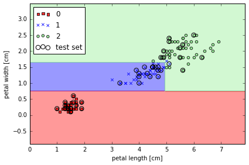
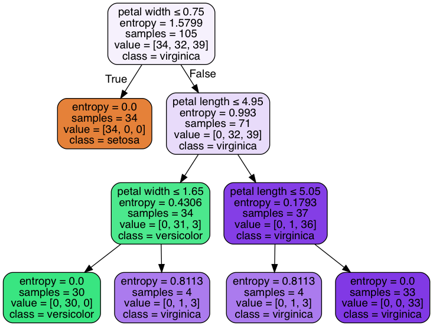
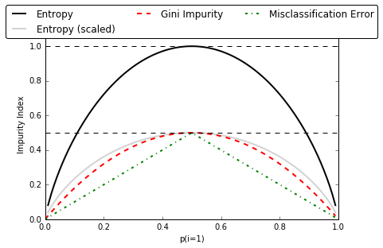
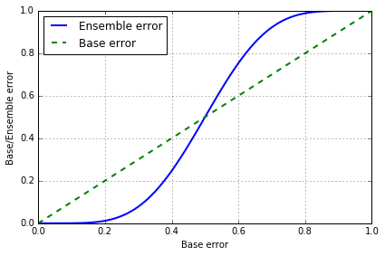
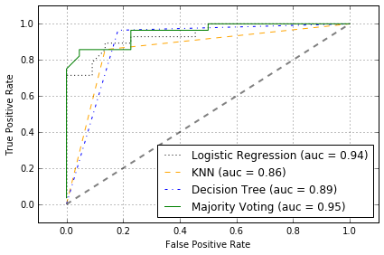
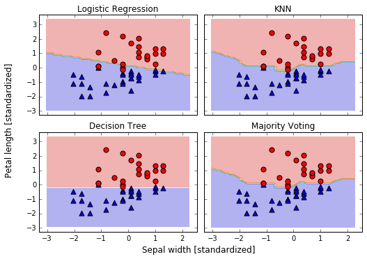
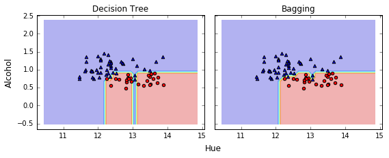
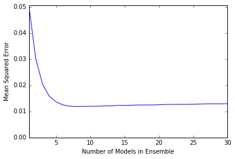
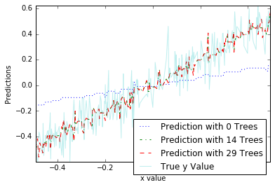
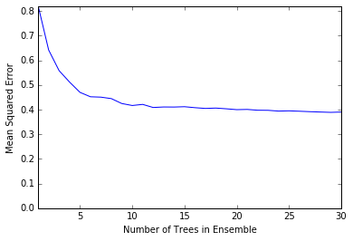

## Sections
- [Decision trees learning](#decision-trees-learning)
    - [Building a decision tree](#building-a-decision-tree)
    - [Visualize a decision tree](#visualize-a-decision-tree)
    - [Different impurity criteria](#different-impurity-criteria)
    - [Implement a binary decision tree in python](#implement-a-binary-decision-tree-in-python)
- [Combining weak to strong learners via random forests](#combining-weak-to-strong-learners-via-random-forests)

- [Learning with ensembles](#learning-with-ensembles)
    - [Majority vote classifier](#majority-vote-classifier)
        - [VotingClassifier in Sklearn](#votingclassifier-in-sklearn)
        - [Combining different algorithms for classification with majority vote](#combining-different-algorithms-for-classification-with-majority-vote)
        - [Evaluating the ensemble classifier](#evaluating-the-ensemble-classifier)
    - [Bagging -- Building an ensemble of classifiers from bootstrap samples](#bagging----building-an-ensemble-of-classifiers-from-bootstrap-samples)
    - [Leveraging weak learners via adaptive boosting](#leveraging-of-weak-learners-via-adaptive-boosting)
- [Algorithm implementation](#algorithm-implementation)

<br>
<br>

# Decision trees learning

[[back to top](#sections)]

Here we'll explore a class of algorithms based on decision trees.
Decision trees at their root are extremely intuitive.  They
encode a series of "if" and "else" choices, similar to how a person might make a decision.
However, which questions to ask, and how to proceed for each answer is entirely learned from the data.

For example, if you wanted to create a guide to identifying an animal found in nature, you
might ask the following series of questions:

- Is the animal bigger or smaller than a meter long?
    + *bigger*: does the animal have horns?
        - *yes*: are the horns longer than ten centimeters?
        - *no*: is the animal wearing a collar
    + *smaller*: does the animal have two or four legs?
        - *two*: does the animal have wings?
        - *four*: does the animal have a bushy tail?

and so on.  This binary splitting of questions is the essence of a decision tree.

One of the main benefit of tree-based models is that they require little preprocessing of the data.
They can work with variables of different types (continuous and discrete) and are invariant to scaling of the features.

Another benefit is that tree-based models are what is called "nonparametric", which means they don't have a fix set of parameters to learn. Instead, a tree model can become more and more flexible, if given more data.
In other words, the number of free parameters grows with the number of samples and is not fixed, as for example in linear models.

<br>
<br>

## Building a decision tree

[[back to top](#sections)]


```python
import numpy as np
from sklearn import datasets
from sklearn.cross_validation import train_test_split
from sklearn.preprocessing import StandardScaler

iris = datasets.load_iris()
X = iris.data[:, [2, 3]]
y = iris.target

X_train, X_test, y_train, y_test = train_test_split(
         X, y, test_size=0.3, random_state=0)

sc = StandardScaler()
sc.fit(X_train)
X_train_std = sc.transform(X_train) # standardize by mean & std
X_test_std = sc.transform(X_test)
```


```python
from matplotlib.colors import ListedColormap
import matplotlib.pyplot as plt
%matplotlib inline

def plot_decision_regions(X, y, classifier, test_idx=None, resolution=0.02):

    # setup marker generator and color map
    markers = ('s', 'x', 'o', '^', 'v')
    colors = ('red', 'blue', 'lightgreen', 'gray', 'cyan')
    cmap = ListedColormap(colors[:len(np.unique(y))])

    # plot the decision surface
    x1_min, x1_max = X[:, 0].min() - 1, X[:, 0].max() + 1
    x2_min, x2_max = X[:, 1].min() - 1, X[:, 1].max() + 1
    xx1, xx2 = np.meshgrid(np.arange(x1_min, x1_max, resolution),
                         np.arange(x2_min, x2_max, resolution))
    Z = classifier.predict(np.array([xx1.ravel(), xx2.ravel()]).T)
    Z = Z.reshape(xx1.shape)
    plt.contourf(xx1, xx2, Z, alpha=0.4, cmap=cmap)
    plt.xlim(xx1.min(), xx1.max())
    plt.ylim(xx2.min(), xx2.max())

    # plot all samples
    for idx, cl in enumerate(np.unique(y)):
        plt.scatter(x=X[y == cl, 0], y=X[y == cl, 1],
                    alpha=0.8, c=cmap(idx),
                    marker=markers[idx], label=cl)
        
    # highlight test samples
    if test_idx:
        X_test, y_test = X[test_idx, :], y[test_idx]   
        plt.scatter(X_test[:, 0], X_test[:, 1], c='', 
                alpha=1.0, linewidth=1, marker='o', 
                s=55, label='test set')
```


```python
from sklearn.tree import DecisionTreeClassifier
# max depth 3 using entropy for impurofy
tree = DecisionTreeClassifier(criterion='entropy', max_depth=3, random_state=0)
tree.fit(X_train, y_train)

X_combined = np.vstack((X_train, X_test))
y_combined = np.hstack((y_train, y_test))
plot_decision_regions(X_combined, y_combined, 
                      classifier=tree, test_idx=range(105,150))

plt.xlabel('petal length [cm]')
plt.ylabel('petal width [cm]')
plt.legend(loc='upper left')
plt.tight_layout()
# plt.savefig('./figures/decision_tree_decision.png', dpi=300)
```





<br>
<br>

## Visualize a decision tree

[[back to top](#sections)]


```python
from sklearn.tree import export_graphviz
# export tree as .dot file, install  GraphViz to transfer the format
export_graphviz(tree, 
                out_file='tree.dot', 
                feature_names=['petal length', 'petal width'])
```


```python
# pip install pydotplus
import pydotplus
from sklearn.externals.six import StringIO
from IPython.display import Image  
dot_data = StringIO()  
export_graphviz(tree, out_file=dot_data,  
                feature_names=['petal length', 'petal width'],  
                class_names=iris.target_names,  
                filled=True, rounded=True,  
                special_characters=True)  
graph = pydotplus.graph_from_dot_data(dot_data.getvalue())  
Image(graph.create_png())  
```





<br>
<br>

## Different impurity criteria

[[back to top](#sections)]


```python
def gini(p):
    return (p)*(1 - (p)) + (1-p)*(1 - (1-p))

def entropy(p):
    return - p*np.log2(p) - (1 - p)*np.log2((1 - p))

def error(p):
    return 1 - np.max([p, 1 - p])

x = np.arange(0.0, 1.0, 0.01)

ent = [entropy(p) if p != 0 else None for p in x]
sc_ent = [e*0.5 if e else None for e in ent]
err = [error(i) for i in x]


fig = plt.figure()
ax = plt.subplot(111)
for i, lab, ls, c, in zip([ent, sc_ent, gini(x), err], 
                  ['Entropy', 'Entropy (scaled)', 
                   'Gini Impurity', 'Misclassification Error'],
                  ['-', '-', '--', '-.'],
                  ['black', 'lightgray', 'red', 'green', 'cyan']):
    line = ax.plot(x, i, label=lab, linestyle=ls, lw=2, color=c)


# 画图
ax.legend(loc='upper center', bbox_to_anchor=(0.5, 1.15),
          ncol=3, fancybox=True, shadow=False)

ax.axhline(y=0.5, linewidth=1, color='k', linestyle='--')
ax.axhline(y=1.0, linewidth=1, color='k', linestyle='--')
plt.ylim([0, 1.1])
plt.xlabel('p(i=1)')
plt.ylabel('Impurity Index')
plt.tight_layout()
# plt.savefig('./figures/impurity.png', dpi=300, bbox_inches='tight')
```





<br>
<br>

## Implement a binary decision tree in python

[[back to top](#sections)]


```python
from collections import Counter
import numpy as np


# 构建一个类，来表征二分树的结构
# Tree 里的属性除了包括左右节点的 Tree 之外，还有此节点中包括数据的标签及其熵值，然后还有要切分 feature 的 idex
class Tree:
    """ Binary Tree"""
    def __init__(self, labels, split_idx=None,
                 children_left=None, children_right=None):
        self.children_left = children_left
        self.children_right = children_right
        self.labels = labels
        self.split_idx = split_idx
        self.entropy = calc_entropy(self.labels)

    def predict(self):
        most_freq = np.bincount(self.labels).argmax()  # find most frequent element
        return most_freq

    def __repr__(self, level=0):
        """ make it easy to visualize a tree"""
        prefix = "\t" * level
        string = prefix + "entropy = {}, labels = {}, [0s, 1s] = {}\n".format(
            self.entropy, self.labels, np.bincount(self.labels, minlength=2))
        if self.split_idx is not None:
            string += prefix + "split on Column {}\n".format(self.split_idx)
            string += prefix + "True:\n"
            string += self.children_left.__repr__(level+1)
            string += prefix + "False:\n"
            string += self.children_right.__repr__(level+1)
        return string


# 计算一组数据里的熵值
def calc_entropy(labels):
    """ calculate entropy from an array of labels"""
    size = float(len(labels))
    cnt = Counter(labels)
    entropy = 0
    for label in set(labels):
        prob = cnt[label] / size
        entropy += -1 * prob * np.log2(prob)
    return entropy


# 不同的决策树算法 (如 ID3, C4.5, CART 等) 会用不同的标准来选择要切分的 feature
# 这里使用的是 Information Gain，即 feature 切分前后的熵值变化
def choose_best_feature_to_split(features, labels):
    """ choose the best split feature which maximize information gain """
    num_features = features.shape[1]
    base_entropy = calc_entropy(labels)

    best_info_gain = 0 
    best_feature = None

    for i in range(num_features):
        new_entropy = 0
        for value in [0, 1]:
            new_labels = labels[features[:, i] == value]
            weight = float(len(new_labels)) / len(labels)
            new_entropy += weight * calc_entropy(new_labels)
        info_gain = base_entropy - new_entropy
        if info_gain > best_info_gain:
            best_info_gain = info_gain
            best_feature = i
    return best_feature


def create_decision_tree(features, labels, 
                         current_depth=0, max_depth=10):
    """ recursively create tree """
    tree = Tree(labels)

    # define stop condition
    # stop when all data in this node are from the same class
    if len(set(labels)) == 1:
        return tree
    # stop when max_depth are reached
    if current_depth >= max_depth:
        return tree

    # split on the best feature found
    best_feature = choose_best_feature_to_split(features, labels)
    if best_feature is None:
        return tree
    
    # recursively build subtrees
    msk = (features[:, best_feature] == 1)
    tree.split_idx = best_feature
    tree.children_left = create_decision_tree(
        features[msk], labels[msk], current_depth+1)
    tree.children_right = create_decision_tree(
        features[~msk], labels[~msk], current_depth+1)
    return tree
```


```python
# 模拟一组数据来测试
data = np.array([[1, 0],
                 [1, 1],
                 [0, 1],
                 [0, 0]])
labels = np.array([1, 0, 0, 0])


tree = create_decision_tree(data, labels)
```


```python
tree
```


    entropy = 0.811278124459, labels = [1 0 0 0], [0s, 1s] = [3 1]
    split on Column 0
    True:
    	entropy = 1.0, labels = [1 0], [0s, 1s] = [1 1]
    	split on Column 1
    	True:
    		entropy = 0.0, labels = [0], [0s, 1s] = [1 0]
    	False:
    		entropy = 0.0, labels = [1], [0s, 1s] = [0 1]
    False:
    	entropy = 0.0, labels = [0 0], [0s, 1s] = [2 0]


```python
# 遍历二分树，来得到分类预测
def _classify(tree, data_row):
    """ prediction for new data"""
    if tree.split_idx is None: # if it's a leaf
        return tree.predict()
    
    split_idx = tree.split_idx
    if data_row[split_idx]:  # if True for split condition
        return _classify(tree.children_left, data_row)
    else:
        return _classify(tree.children_right, data_row)
    
def classify(tree, data):
    data = np.array(data)
    num_row = data.shape[0]
    results = np.empty(shape=num_row)
    for i in range(num_row):
        results[i] = _classify(tree, data[i, :])
    return results
```


```python
new_data = [[0, 0],
            [1, 0]]

classify(tree, new_data)
```


    array([ 0.,  1.])


<br>
<br>

# Combining weak to strong learners via random forests

[[back to top](#sections)]

可以看做是 ensemble of decision trees, 将弱的模型结合在一起变成强模型. 更易扩展, 且较少会 overfitting.

1. draw a random **bootstrap** sample of size n (with replacement)
2. grow decision tree from bootstrap sample, at each node:
    - randomly select d features without replacement
    - split node using feature that provides best split
3. repeat 1 & 2 k times.
4. aggregate the prediction by each tree to assign the class label by **majority vote**


```python
from sklearn.ensemble import RandomForestClassifier
# from 10 decision trees, n_jobs 值使用 cpu 个数
forest = RandomForestClassifier(criterion='entropy',
                                n_estimators=10, 
                                random_state=1,
                                n_jobs=2)
forest.fit(X_train, y_train)

plot_decision_regions(X_combined, y_combined, 
                      classifier=forest, test_idx=range(105,150))

plt.xlabel('petal length [cm]')
plt.ylabel('petal width [cm]')
plt.legend(loc='upper left')
plt.tight_layout()
# plt.savefig('./figures/random_forest.png', dpi=300)
```


<br>
<br>

# Learning with ensembles

将一系列分类器集合起来, 取多数为分类结果

Build powerful models from weak learners that learn from their mistakes

ensemble method 就是讲多个不同的分类器集合组合为一个大的分类器. 选择最终结果是以 majority voting

即使每个单独的分类器错误率较高, 但将多个分类器组合之后, 错误率就会大大降低

[[back to top](#sections)]

假设我们组合了 n 个分类器，它们的错误率都为 $$ \varepsilon $$, 各个分类器之间独立。  
则这 n 个分类器里, 多于 k 个分类器分类错误的概率为
$$ P(y \geq k) = \sum^n_k \binom{n}{k} \varepsilon^k (1-\varepsilon)^{n-k}$$


```python
from scipy.misc import comb
import math

# emsemble error rate
def ensemble_error(n_classifier, error):
    k_start = int(math.ceil(n_classifier / 2.0))
    probs = [comb(n_classifier, k) * error**k * 
               (1-error)**(n_classifier - k) 
             for k in range(k_start, n_classifier + 1)]
    return sum(probs)
```


```python
# 11个分类器, 每个分类器的 error rate 是0.25的话, 通过 combinator 之后的 error rate
ensemble_error(n_classifier=11, error=0.25)
```


    0.034327507019042969


```python
# ensemble error 和 base error 的关系
error_range = np.arange(0.0, 1.01, 0.01)
ens_errors = [ensemble_error(n_classifier=11, error=error) 
              for error in error_range]

plt.plot(error_range, ens_errors, 
         label='Ensemble error', linewidth=2)

plt.plot(error_range, error_range, 
         linestyle='--', label='Base error',linewidth=2)

plt.xlabel('Base error')
plt.ylabel('Base/Ensemble error')
plt.legend(loc='upper left')
plt.grid()
plt.tight_layout()
# plt.savefig('./figures/ensemble_err.png', dpi=300)
```





$$\varepsilon$$ < 0.5 时, emsemble error 都要低于 base error, $$\varepsilon$$ > 0.5 时, emsemble error 就会大于 base error

<br>
<br>

# Majority vote classifier 

combine different classication algorithms associated with individual weights for confidence

[[back to top](#sections)]

当多个分类器 C 拥有相同权重时，ensemble 给出的预测 $$\hat y$$ 为众数：
$$ \hat y = mode\{C_1(x), C_2(x), \dotso, C_m(x)\} $$

若分类器 $$C_j$$ 对应不同的权重 $$w_j$$, 则
$$ \hat y = \arg\max_i \sum^m_{j=1}w_j P_{ij} $$
其中 $$P_{ij}$$ 是 $$C_j$$ 预测结果为 i 的概率


```python
import numpy as np
np.argmax(np.bincount([0, 0, 1], 
                      weights=[0.2, 0.2, 0.6]))

# np.argmax: returns the indices of the maximum values along an axis.
# np.bincount: Count number of occurrences of each value in array of non-negative ints
```


    1


```python
np.bincount([0, 0, 1], 
                      weights=[0.2, 0.2, 0.6])
```


    array([ 0.4,  0.6])


```python
ex = np.array([[0.9, 0.1],  # C1 的预测结果
               [0.8, 0.2],  # C2 的预测结果
               [0.4, 0.6]]) # C3 的预测结果

p = np.average(ex, 
               axis=0, 
               weights=[0.2, 0.2, 0.6])  # C1, C2, C3 的权重
p
```


    array([ 0.58,  0.42])


$$p(i_0| x) = 0.58$$
$$p(i_1 | x) = 0.42$$
$$\hat y = \arg\max_i [p(i_0 | x), p(i_1 | x)] = 0$$


```python
np.argmax(p)
```


    0


<br>
<br>

## VotingClassifier in Sklearn
使用 Sklearn 中自带的 [VotingClassifier](http://scikit-learn.org/stable/modules/generated/sklearn.ensemble.VotingClassifier.html)

[[back to top](#sections)]


```python
import numpy as np
from sklearn.linear_model import LogisticRegression
from sklearn.naive_bayes import GaussianNB
from sklearn.ensemble import RandomForestClassifier
from sklearn.ensemble import VotingClassifier

# 使用 3 个分类器
clf1 = LogisticRegression(random_state=1)
clf2 = RandomForestClassifier(random_state=1)
clf3 = GaussianNB()

# 生成数据
X = np.array([[-1, -1], [-2, -1], [-3, -2], [1, 1], [2, 1], [3, 2]])
y = np.array([1, 1, 1, 2, 2, 2])

# voting='hard', uses predicted class labels for majority rule voting.
eclf1 = VotingClassifier(estimators=[
        ('lr', clf1), ('rf', clf2), ('gnb', clf3)], voting='hard')
eclf1 = eclf1.fit(X, y)
print(eclf1.predict(X))

# voting='soft', predicts the class label based on the argmax of the sums of the predicted probalities 
eclf2 = VotingClassifier(estimators=[
        ('lr', clf1), ('rf', clf2), ('gnb', clf3)],
        voting='soft')
eclf2 = eclf2.fit(X, y)
print(eclf2.predict(X))

# add weight
eclf3 = VotingClassifier(estimators=[
       ('lr', clf1), ('rf', clf2), ('gnb', clf3)],
       voting='soft', weights=[2,1,1])
eclf3 = eclf3.fit(X, y)
print(eclf3.predict(X))
```

    [1 1 1 2 2 2]
    [1 1 1 2 2 2]
    [1 1 1 2 2 2]


<br>
<br>

## Combining different algorithms for classification with majority vote

[[back to top](#sections)]


```python
from sklearn import datasets
from sklearn.cross_validation import train_test_split
from sklearn.preprocessing import StandardScaler
from sklearn.preprocessing import LabelEncoder

# load iris data
iris = datasets.load_iris()
X, y = iris.data[50:, [1, 2]], iris.target[50:]

st = StandardScaler()
X = st.fit_transform(X)

le = LabelEncoder()
y = le.fit_transform(y)

# 50% train, 50% test
X_train, X_test, y_train, y_test = \
    train_test_split(X, y, test_size=0.5, random_state=1)
```


```python
from sklearn.linear_model import LogisticRegression
from sklearn.neighbors import KNeighborsClassifier
from sklearn.tree import DecisionTreeClassifier
from sklearn.cross_validation import cross_val_score

clf1 = LogisticRegression(C=0.01, random_state=42)
clf2 = KNeighborsClassifier(n_neighbors=1)
clf3 = DecisionTreeClassifier(max_depth=1, random_state=42)

clf_labels = ['Logistic Regression', 'KNN', 'Decision Tree']
all_clf = [clf1, clf2, clf3]

print('10-fold cross validation:\n')
for clf, label in zip(all_clf, clf_labels):
    scores = cross_val_score(estimator=clf, X=X_train, y=y_train,
                             cv=10, scoring='roc_auc')
    print("ROC AUC: %0.2f (+/- %0.2f) [%s]"
             % (scores.mean(), scores.std(), label))
```

    10-fold cross validation:
    
    ROC AUC: 0.93 (+/- 0.15) [Logistic Regression]
    ROC AUC: 0.93 (+/- 0.10) [KNN]
    ROC AUC: 0.92 (+/- 0.15) [Decision Tree]


```python
from sklearn.ensemble import VotingClassifier

mv_clf = VotingClassifier(
    estimators=[('c1', clf1), ('c2', clf2), ('c3', clf3)], voting='soft')

clf_labels += ['Majority Voting']
all_clf += [mv_clf]

print('10-fold cross validation:\n')
for clf, label in zip(all_clf, clf_labels):
    scores = cross_val_score(estimator=clf, X=X_train, y=y_train,
                             cv=10, scoring='roc_auc')
    print("ROC AUC: %0.2f (+/- %0.2f) [%s]"
             % (scores.mean(), scores.std(), label))
```

    10-fold cross validation:
    
    ROC AUC: 0.93 (+/- 0.15) [Logistic Regression]
    ROC AUC: 0.93 (+/- 0.10) [KNN]
    ROC AUC: 0.92 (+/- 0.15) [Decision Tree]
    ROC AUC: 0.97 (+/- 0.10) [Majority Voting]


最后一个是 majority voting, 明显比单独的分类器结果好

<br>
<br>

## Evaluating the ensemble classifier

[[back to top](#sections)]

在测试集上评估各个分类器的 ROC AUC


```python
from sklearn.metrics import roc_curve
from sklearn.metrics import auc

colors = ['black', 'orange', 'blue', 'green']
linestyles = [':', '--', '-.', '-']
for clf, label, clr, ls \
        in zip(all_clf, clf_labels, colors, linestyles):

    # assuming the label of the positive class is 1
    y_pred = clf.fit(X_train, y_train).predict_proba(X_test)[:, 1]
    fpr, tpr, thresholds = roc_curve(y_true=y_test, 
                                     y_score=y_pred)
    roc_auc = auc(x=fpr, y=tpr)
    plt.plot(fpr, tpr, 
             color=clr, 
             linestyle=ls, 
             label='%s (auc = %0.2f)' % (label, roc_auc))

plt.legend(loc='lower right')
plt.plot([0, 1], [0, 1], 
         linestyle='--', 
         color='gray', 
         linewidth=2)

plt.xlim([-0.1, 1.1])
plt.ylim([-0.1, 1.1])
plt.grid()
plt.xlabel('False Positive Rate')
plt.ylabel('True Positive Rate')

plt.tight_layout()
# plt.savefig('./figures/roc.png', dpi=300)
```





ROC 可看出, ensemble classfifier 在 test set 上表现不错

对比决策边界


```python
from itertools import product

x_min = X_train[:, 0].min() - 1
x_max = X_train[:, 0].max() + 1
y_min = X_train[:, 1].min() - 1
y_max = X_train[:, 1].max() + 1

xx, yy = np.meshgrid(np.arange(x_min, x_max, 0.1),
                     np.arange(y_min, y_max, 0.1))

# 添加 subplots
f, axarr = plt.subplots(nrows=2, ncols=2, 
                        sharex='col', sharey='row', 
                        figsize=(7, 5))

for idx, clf, tt in zip(product([0, 1], [0, 1]),
                        all_clf, clf_labels):
    clf.fit(X_train, y_train)
    Z = clf.predict(np.vstack([xx.ravel(), yy.ravel()]).T)
    Z = Z.reshape(xx.shape)

    axarr[idx[0], idx[1]].contourf(xx, yy, Z, alpha=0.3)
    axarr[idx[0], idx[1]].scatter(X_train[y_train==0, 0], 
                                  X_train[y_train==0, 1], 
                                  c='blue', marker='^', s=50)
    axarr[idx[0], idx[1]].scatter(X_train[y_train==1, 0], 
                                  X_train[y_train==1, 1], 
                                  c='red', marker='o', s=50)
    axarr[idx[0], idx[1]].set_title(tt)

plt.text(-3.5, -4.5, 
         s='Sepal width [standardized]', 
         ha='center', va='center', fontsize=12)
plt.text(-10.5, 4.5, 
         s='Petal length [standardized]', 
         ha='center', va='center', 
         fontsize=12, rotation=90)

plt.tight_layout()
# plt.savefig('./figures/voting_panel', bbox_inches='tight', dpi=300)
```





<br>
<br>

# Bagging -- Building an ensemble of classifiers from bootstrap samples

+ draw `bootstrap` samples (random samples with replacement) from initial training set
+ random forests are a special case of bagging where we also use random feature subsets to fit the individual decision trees

[[back to top](#sections)]


```python
import pandas as pd
# wine dataset
df_wine = pd.read_csv('ftp://ftp.ics.uci.edu/pub/machine-learning-databases/wine/wine.data', 
                      header=None)

df_wine.columns = ['Class label', 'Alcohol', 'Malic acid', 'Ash', 
'Alcalinity of ash', 'Magnesium', 'Total phenols', 
'Flavanoids', 'Nonflavanoid phenols', 'Proanthocyanins', 
'Color intensity', 'Hue', 'OD280/OD315 of diluted wines', 'Proline']

# only consider Wine classes 2 and 3
df_wine = df_wine[df_wine['Class label'] != 1]

y = df_wine['Class label'].values
X = df_wine[['Alcohol', 'Hue']].values
```


```python
from sklearn.preprocessing import LabelEncoder
from sklearn.cross_validation import train_test_split

# 转换 label
le = LabelEncoder()
y = le.fit_transform(y)

# 60% train, 40% test
X_train, X_test, y_train, y_test = \
    train_test_split(X, y, test_size=0.40, random_state=1)
```


```python
# sklearn 提供的 BaggingClassifier， 其实功能已经超过 Bagging 了
# 它既能对 samples 采样，也能对 features 采样
from sklearn.ensemble import BaggingClassifier
from sklearn.tree import DecisionTreeClassifier

tree = DecisionTreeClassifier(criterion='entropy')

# 用 Decision Tree 作 base 
bag = BaggingClassifier(base_estimator=tree,
                        n_estimators=500, 
                        max_samples=1.0,  # 子采样 samples 的比例
                        max_features=1.0,  # 子采样 features 的比例
                        bootstrap=True,   # 采样 samples 时是否使用 bootstrap
                        bootstrap_features=False,  # 采样 features 时是否使用 bootstrap
                        random_state=1)
```


```python
from sklearn.metrics import accuracy_score

tree = tree.fit(X_train, y_train)
y_train_pred = tree.predict(X_train)
y_test_pred = tree.predict(X_test)

tree_train = accuracy_score(y_train, y_train_pred)
tree_test = accuracy_score(y_test, y_test_pred)
print('Decision tree train/test accuracies %.3f/%.3f'
      % (tree_train, tree_test))

bag = bag.fit(X_train, y_train)
y_train_pred = bag.predict(X_train)
y_test_pred = bag.predict(X_test)

bag_train = accuracy_score(y_train, y_train_pred) 
bag_test = accuracy_score(y_test, y_test_pred) 
print('Bagging train/test accuracies %.3f/%.3f'
      % (bag_train, bag_test))
```

    Decision tree train/test accuracies 1.000/0.854
    Bagging train/test accuracies 1.000/0.896


使用 Bagging 之后，测试集的准确率有提升


```python
# 画决策边界
%matplotlib inline
import numpy as np
import matplotlib.pyplot as plt

x_min = X_train[:, 0].min() - 1
x_max = X_train[:, 0].max() + 1
y_min = X_train[:, 1].min() - 1
y_max = X_train[:, 1].max() + 1

xx, yy = np.meshgrid(np.arange(x_min, x_max, 0.1),
                     np.arange(y_min, y_max, 0.1))

f, axarr = plt.subplots(nrows=1, ncols=2, 
                        sharex='col', 
                        sharey='row', 
                        figsize=(8, 3))


for idx, clf, tt in zip([0, 1],
                        [tree, bag],
                        ['Decision Tree', 'Bagging']):
    clf.fit(X_train, y_train)
    
    Z = clf.predict(np.vstack([xx.ravel(), yy.ravel()]).T)
    Z = Z.reshape(xx.shape)

    axarr[idx].contourf(xx, yy, Z, alpha=0.3)
    axarr[idx].scatter(X_train[y_train==0, 0], 
                       X_train[y_train==0, 1], 
                       c='blue', marker='^')
    
    axarr[idx].scatter(X_train[y_train==1, 0], 
                       X_train[y_train==1, 1], 
                       c='red', marker='o')
    
    axarr[idx].set_title(tt)

axarr[0].set_ylabel('Alcohol', fontsize=12)
plt.text(10.2, -1.2, s='Hue', 
         ha='center', va='center', fontsize=12)
    
plt.tight_layout()
#plt.savefig('./figures/bagging_region.png', 
#            dpi=300, 
#            bbox_inches='tight')
```





Bagging 减少了 overfitting， 使决策边界更平滑

<br>
<br>

# Leveraging of weak learners via adaptive boosting
let the weak learners subsequently learn from misclassified training samples to improve the performance of the ensemble

[[back to top](#sections)]

Adaptive boosting (AdaBoost)
1. Set weight vector w to uniform weights where $$\sum_i w_i = 1$$
2. For j in m boosting rounds, do the following:
3. Train a weighted weak learner: $$C_j = train(X,y,w)$$.
4. Predict class labels: $$\hat{y} = predict(C_j, X)$$ .
5. Compute weighted error rate: $$\epsilon = w \cdot (\hat{y} \neq y)$$.
6. Compute coefficient: $$\alpha_j = \frac 1 2 ln\frac{1-\epsilon}{\epsilon}$$ .
7. Update weights: $$w:= w \times exp(-\alpha_j \times \hat{y} \times y)$$ .
8. Normalize weights to sum to 1: $$w:= \frac{w}{\sum_i w_i}$$ .
9. Compute final prediction: $$\hat{y} = (\sum_{j=1}^{m}(\alpha_j \times predict(C_j, X))>0)$$.

$$\cdot$$ denotes dot product between two vectors  
$$\times$$ denotes element-wise multiplication of two vectors


```python
from sklearn.ensemble import AdaBoostClassifier

tree = DecisionTreeClassifier(criterion='entropy', 
                              max_depth=1)

ada = AdaBoostClassifier(base_estimator=tree,
                         n_estimators=500, 
                         learning_rate=0.1,
                         random_state=0)
```


```python
tree = tree.fit(X_train, y_train)
y_train_pred = tree.predict(X_train)
y_test_pred = tree.predict(X_test)

tree_train = accuracy_score(y_train, y_train_pred)
tree_test = accuracy_score(y_test, y_test_pred)
print('Decision tree train/test accuracies %.3f/%.3f'
      % (tree_train, tree_test))

ada = ada.fit(X_train, y_train)
y_train_pred = ada.predict(X_train)
y_test_pred = ada.predict(X_test)

ada_train = accuracy_score(y_train, y_train_pred) 
ada_test = accuracy_score(y_test, y_test_pred) 
print('AdaBoost train/test accuracies %.3f/%.3f'
      % (ada_train, ada_test))
```

    Decision tree train/test accuracies 0.845/0.854
    AdaBoost train/test accuracies 1.000/0.875


Adaboost 可以减少 Bias，但可能引入更多的 Variance


```python
x_min, x_max = X_train[:, 0].min() - 1, X_train[:, 0].max() + 1
y_min, y_max = X_train[:, 1].min() - 1, X_train[:, 1].max() + 1
xx, yy = np.meshgrid(np.arange(x_min, x_max, 0.1),
                     np.arange(y_min, y_max, 0.1))

f, axarr = plt.subplots(1, 2, sharex='col', sharey='row', figsize=(8, 3))


for idx, clf, tt in zip([0, 1],
                        [tree, ada],
                        ['Decision Tree', 'AdaBoost']):
    clf.fit(X_train, y_train)
    
    Z = clf.predict(np.vstack([xx.ravel(), yy.ravel()]).T)
    Z = Z.reshape(xx.shape)

    axarr[idx].contourf(xx, yy, Z, alpha=0.3)
    axarr[idx].scatter(X_train[y_train==0, 0], 
                       X_train[y_train==0, 1], 
                       c='blue', marker='^')
    axarr[idx].scatter(X_train[y_train==1, 0], 
                       X_train[y_train==1, 1], 
                       c='red', marker='o')
    axarr[idx].set_title(tt)

axarr[0].set_ylabel('Alcohol', fontsize=12)
plt.text(10.2, -1.2, s='Hue', 
         ha='center', va='center', fontsize=12)
    
plt.tight_layout()
#plt.savefig('./figures/adaboost_region.png', 
#           dpi=300, 
#           bbox_inches='tight')
```


Adaboost 的决策边界比 tree 复杂, 与 BaggingClassifier 相似.

Ensemble method 需要更多的计算资源, 这个在实际运用中也是要考虑的.

<br>
<br>

# Algorithm implementation

[[back to top](#sections)]

### 广义提升树算法详解


```python
import numpy
import matplotlib.pyplot as plot
%matplotlib inline
from sklearn import tree
from sklearn.tree import DecisionTreeRegressor
from math import floor
import random
```


```python
# Build a simple data set with y = x + random
n_points = 1000

# x values for plotting
x_plot = [(float(i) / float(n_points) - 0.5) for i in range(n_points + 1)]

# x needs to be list of lists.
x = [[s] for s in x_plot]

# y (labels) has random noise added to x-value
# set seed
numpy.random.seed(1)
y = [s + numpy.random.normal(scale=0.1) for s in x_plot]

# take fixed test set 30% of sample
n_sample = int(n_points * 0.30)
idx_test = random.sample(range(n_points), n_sample)
idx_test.sort()
idx_train = [idx for idx in range(n_points) if not (idx in idx_test)]

# Define test and training attribute and label sets
x_train = [x[r] for r in idx_train]
x_test = [x[r] for r in idx_test]
y_train = [y[r] for r in idx_train]
y_test = [y[r] for r in idx_test]

# train a series of models on random subsets of the training data
# collect the models in a list and check error of composite as list grows

# maximum number of models to generate
num_trees_max = 30

# tree depth - typically at the high end
tree_depth = 5

# initialize a list to hold models
mode_list = []
pred_list = []
eps = 0.3

# initialize residuals to be the labels y
residuals = list(y_train)

for i_trees in range(num_trees_max):
    mode_list.append(DecisionTreeRegressor(max_depth=tree_depth))
    mode_list[-1].fit(x_train, residuals)

    # make prediction with latest model and add to list of predictions
    latest_in_sample_prediction = mode_list[-1].predict(x_train)

    # use new predictions to update residuals
    residuals = [residuals[i] - eps * latest_in_sample_prediction[i]
                 for i in range(len(residuals))]

    latest_out_sample_prediction = mode_list[-1].predict(x_test)
    pred_list.append(list(latest_out_sample_prediction))

# build cumulative prediction from first "n" models
mse = []
all_predictions = []
for i_models in range(len(mode_list)):

    # add the first "i_models" of the predictions and multiply by eps
    prediction = []
    for i_pred in range(len(x_test)):
        prediction.append(
            sum([pred_list[i][i_pred] for i in range(i_models + 1)]) * eps)

    all_predictions.append(prediction)
    errors = [(y_test[i] - prediction[i]) for i in range(len(y_test))]
    mse.append(sum([e * e for e in errors]) / len(y_test))

n_models = [i + 1 for i in range(len(mode_list))]
```


```python
plot.plot(n_models, mse)
plot.axis('tight')
plot.xlabel('Number of Models in Ensemble')
plot.ylabel('Mean Squared Error')
plot.ylim((0.0, max(mse)))
plot.show()

plot_list = [0, 14, 29]
line_type = [':', '-.', '--']
plot.figure()
for i in range(len(plot_list)):
    i_plot = plot_list[i]
    text_legend = 'Prediction with ' + str(i_plot) + ' Trees'
    plot.plot(x_test, all_predictions[i_plot], label=text_legend,
              linestyle=line_type[i])
plot.plot(x_test, y_test, label='True y Value', alpha=0.25)
plot.legend(bbox_to_anchor=(1, 0.3))
plot.axis('tight')
plot.xlabel('x value')
plot.ylabel('Predictions');
```








<br>
<br>

### 随机森林算法详解


```python
import urllib2
import numpy
from sklearn import tree
from sklearn.tree import DecisionTreeRegressor
import random
from math import sqrt
import matplotlib.pyplot as plot

# read data into iterable
target_url = "ftp://ftp.ics.uci.edu/pub/machine-learning-databases/wine-quality/winequality-red.csv"
data = urllib2.urlopen(target_url)

x_list = []
labels = []
names = []
first_line = True
for line in data:
    if first_line:
        names = line.strip().split(";")
        first_line = False
    else:
        # split on semi-colon
        row = line.strip().split(";")
        # put labels in separate array
        labels.append(float(row[-1]))
        # remove label from row
        row.pop()
        # convert row to floats
        float_row = [float(num) for num in row]
        x_list.append(float_row)

nrows = len(x_list)
ncols = len(x_list[0])

# take fixed test set 30% of sample
random.seed(1)  # set seed so results are the same each run
n_sample = int(nrows * 0.30)
idx_test = random.sample(range(nrows), n_sample)
idx_test.sort()
idx_train = [idx for idx in range(nrows) if not (idx in idx_test)]

# Define test and training attribute and label sets
x_train = [x_list[r] for r in idx_train]
x_test = [x_list[r] for r in idx_test]
y_train = [labels[r] for r in idx_train]
y_test = [labels[r] for r in idx_test]

# train a series of models on random subsets of the training data
# collect the models in a list and check error of composite as list grows

# maximum number of models to generate
num_trees_max = 30

# tree depth - typically at the high end
tree_depth = 12

# pick how many attributes will be used in each model.
# authors recommend 1/3 for regression problem
n_attr = 4

# initialize a list to hold models
mode_list = []
index_list = []
pred_list = []
n_train_rows = len(y_train)

for i_trees in range(num_trees_max):

    mode_list.append(DecisionTreeRegressor(max_depth=tree_depth))

    # take random sample of attributes
    idx_attr = random.sample(range(ncols), n_attr)
    idx_attr.sort()
    index_list.append(idx_attr)

    # take a random sample of training rows
    idx_rows = []
    for i in range(int(0.5 * n_train_rows)):
        idx_rows.append(random.choice(range(len(x_train))))
    idx_rows.sort()

    # build training set
    x_rf_train = []
    y_rf_train = []

    for i in range(len(idx_rows)):
        temp = [x_train[idx_rows[i]][j] for j in idx_attr]
        x_rf_train.append(temp)
        y_rf_train.append(y_train[idx_rows[i]])

    mode_list[-1].fit(x_rf_train, y_rf_train)

    # restrict xTest to attributes selected for training
    x_rf_test = []
    for xx in x_test:
        temp = [xx[i] for i in idx_attr]
        x_rf_test.append(temp)

    latest_out_sample_prediction = mode_list[-1].predict(x_rf_test)
    pred_list.append(list(latest_out_sample_prediction))

# build cumulative prediction from first "n" models
mse = []
all_predictions = []
for i_models in range(len(mode_list)):

    # add the first "iModels" of the predictions and multiply by eps
    prediction = []
    for i_pred in range(len(x_test)):
        prediction.append(
            sum([pred_list[i][i_pred] for i in range(i_models + 1)]) / (
            i_models + 1))

    all_predictions.append(prediction)
    errors = [(y_test[i] - prediction[i]) for i in range(len(y_test))]
    mse.append(sum([e * e for e in errors]) / len(y_test))

n_models = [i + 1 for i in range(len(mode_list))]

plot.plot(n_models, mse)
plot.axis('tight')
plot.xlabel('Number of Trees in Ensemble')
plot.ylabel('Mean Squared Error')
plot.ylim((0.0, max(mse)))
plot.show()

print('Minimum MSE')
print(min(mse))
```





    Minimum MSE
    0.389088116065


## 练习题： 使用提升树和随机森林两种方法，对信贷数据集进行建模比较


```python

```

<br>
<br>

<br>
<br>
