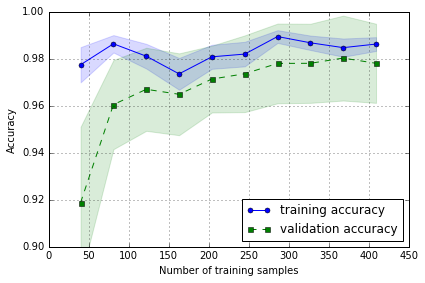
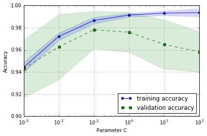

## Sections

- [Loading the Breast Cancer Wisconsin dataset](#loading-the-breast-cancer-wisconsin-dataset)
- [Streamlining workflows with pipelines](#streamlining-workflows-with-pipelines)

- [Model evaluation](#model-evaluation)
    - [The holdout method](#the-holdout-method)
    - [K-fold cross validation](#k-fold-cross-validation)
    - [Stratified k-fold cross validation](#stratified-k-fold-cross-validation)
- [Learning and validation curves](#learning-and-validation-curves)
    - [Diagnosing bias and variance problems with learning curves](#diagnosing-bias-and-variance-problems-with-learning-curves)
    - [Addressing overfitting and underfitting with validation curves](#dddressing-overfitting-and-underfitting-with-validation-curves)
- [Grid search](#grid-search)
    - [Tuning hyperparameters via grid search ](#tuning-hyperparameters-via-grid-search)
    - [Randomized search](#randomized-search)
    - [Model selection with nested cross-validation](#model-selection-with-nested-cross-validation)

<br>
<br>

# Loading the Breast Cancer Wisconsin dataset

+ Breast Cancer Wisconsin 数据包括 569 例良性或恶性癌细胞样本
+ 数据前两列是样本 ID 及诊断 (M for malignant 恶性, B for benigh 良性)
+ 后面 30 列是细胞核的图片的数据

[[back to top](#sections)]


```python
import pandas as pd

df = pd.read_csv('data/wdbc.data', header=None)
df.head()
```


<div>
<table border="1" class="dataframe">
  <thead>
    <tr style="text-align: right;">
      <th></th>
      <th>0</th>
      <th>1</th>
      <th>2</th>
      <th>3</th>
      <th>4</th>
      <th>5</th>
      <th>6</th>
      <th>7</th>
      <th>8</th>
      <th>9</th>
      <th>...</th>
      <th>22</th>
      <th>23</th>
      <th>24</th>
      <th>25</th>
      <th>26</th>
      <th>27</th>
      <th>28</th>
      <th>29</th>
      <th>30</th>
      <th>31</th>
    </tr>
  </thead>
  <tbody>
    <tr>
      <th>0</th>
      <td>842302</td>
      <td>M</td>
      <td>17.99</td>
      <td>10.38</td>
      <td>122.80</td>
      <td>1001.0</td>
      <td>0.11840</td>
      <td>0.27760</td>
      <td>0.3001</td>
      <td>0.14710</td>
      <td>...</td>
      <td>25.38</td>
      <td>17.33</td>
      <td>184.60</td>
      <td>2019.0</td>
      <td>0.1622</td>
      <td>0.6656</td>
      <td>0.7119</td>
      <td>0.2654</td>
      <td>0.4601</td>
      <td>0.11890</td>
    </tr>
    <tr>
      <th>1</th>
      <td>842517</td>
      <td>M</td>
      <td>20.57</td>
      <td>17.77</td>
      <td>132.90</td>
      <td>1326.0</td>
      <td>0.08474</td>
      <td>0.07864</td>
      <td>0.0869</td>
      <td>0.07017</td>
      <td>...</td>
      <td>24.99</td>
      <td>23.41</td>
      <td>158.80</td>
      <td>1956.0</td>
      <td>0.1238</td>
      <td>0.1866</td>
      <td>0.2416</td>
      <td>0.1860</td>
      <td>0.2750</td>
      <td>0.08902</td>
    </tr>
    <tr>
      <th>2</th>
      <td>84300903</td>
      <td>M</td>
      <td>19.69</td>
      <td>21.25</td>
      <td>130.00</td>
      <td>1203.0</td>
      <td>0.10960</td>
      <td>0.15990</td>
      <td>0.1974</td>
      <td>0.12790</td>
      <td>...</td>
      <td>23.57</td>
      <td>25.53</td>
      <td>152.50</td>
      <td>1709.0</td>
      <td>0.1444</td>
      <td>0.4245</td>
      <td>0.4504</td>
      <td>0.2430</td>
      <td>0.3613</td>
      <td>0.08758</td>
    </tr>
    <tr>
      <th>3</th>
      <td>84348301</td>
      <td>M</td>
      <td>11.42</td>
      <td>20.38</td>
      <td>77.58</td>
      <td>386.1</td>
      <td>0.14250</td>
      <td>0.28390</td>
      <td>0.2414</td>
      <td>0.10520</td>
      <td>...</td>
      <td>14.91</td>
      <td>26.50</td>
      <td>98.87</td>
      <td>567.7</td>
      <td>0.2098</td>
      <td>0.8663</td>
      <td>0.6869</td>
      <td>0.2575</td>
      <td>0.6638</td>
      <td>0.17300</td>
    </tr>
    <tr>
      <th>4</th>
      <td>84358402</td>
      <td>M</td>
      <td>20.29</td>
      <td>14.34</td>
      <td>135.10</td>
      <td>1297.0</td>
      <td>0.10030</td>
      <td>0.13280</td>
      <td>0.1980</td>
      <td>0.10430</td>
      <td>...</td>
      <td>22.54</td>
      <td>16.67</td>
      <td>152.20</td>
      <td>1575.0</td>
      <td>0.1374</td>
      <td>0.2050</td>
      <td>0.4000</td>
      <td>0.1625</td>
      <td>0.2364</td>
      <td>0.07678</td>
    </tr>
  </tbody>
</table>
<p>5 rows × 32 columns</p>
</div>


```python
df.shape
```


    (569, 32)


```python
# 数据预处理
from sklearn.preprocessing import LabelEncoder
X = df.loc[:, 2:].values
y = df.loc[:, 1].values
le = LabelEncoder()
y = le.fit_transform(y)
le.transform(['M', 'B']) # M->1 B->0
```


    array([1, 0])


```python
# 80% train, 20% test
from sklearn.cross_validation import train_test_split

X_train, X_test, y_train, y_test = \
        train_test_split(X, y, test_size=0.20, random_state=1)
```

<br>
<br>

# Streamlining workflows with pipelines

fit a model including an arbitrary number of transformation steps and apply it to make predictions about new data.

[[back to top](#sections)]


```python
# chain the StandardScaler, PCA, and LogisticRegression objects in a pipeline
from sklearn.preprocessing import StandardScaler
from sklearn.decomposition import PCA
from sklearn.linear_model import LogisticRegression
from sklearn.pipeline import Pipeline

pipe_lr = Pipeline([('scl', StandardScaler()),  # 标准化原始数据
                    ('pca', PCA(n_components=2)), # PCA 降维
                    ('clf', LogisticRegression(random_state=1))])

pipe_lr.fit(X_train, y_train)
print('Test Accuracy: %.3f' % pipe_lr.score(X_test, y_test))
y_pred = pipe_lr.predict(X_test)
```

    Test Accuracy: 0.947


<br>
<br>

# Model evaluation

[[back to top](#sections)]

## The holdout method
将数据分为三个部分
+ training set 用于训练模型
+ validation set 用于模型选择和调参
+ test set 用于评估最终模型的泛化能力

[[back to top](#sections)]


<br>
<br>

## K-fold cross validation
重复 hold out method k 次. 保留 test set，剩下数据随机分为 k 组, 将其中一组留作 validation set, 其余做 training data, 更换 validation 组重复训练 k 次

[[back to top](#sections)]


```python
import numpy as np
from sklearn.cross_validation import KFold

kfold = KFold(n=len(X_train), n_folds=10, random_state=1)

scores = []
for k, (train, test) in enumerate(kfold):
    pipe_lr.fit(X_train[train], y_train[train])
    score = pipe_lr.score(X_train[test], y_train[test])
    scores.append(score)
    print('Fold: %s, Class dist.: %s, Acc: %.3f' % (k+1, np.bincount(y_train[train]), score))
    
print('\nCV accuracy: %.3f +/- %.3f' % (np.mean(scores), np.std(scores)))
```

    Fold: 1, Class dist.: [256 153], Acc: 0.891
    Fold: 2, Class dist.: [254 155], Acc: 0.957
    Fold: 3, Class dist.: [258 151], Acc: 0.978
    Fold: 4, Class dist.: [257 152], Acc: 0.913
    Fold: 5, Class dist.: [255 154], Acc: 0.935
    Fold: 6, Class dist.: [258 152], Acc: 0.978
    Fold: 7, Class dist.: [257 153], Acc: 0.933
    Fold: 8, Class dist.: [254 156], Acc: 0.956
    Fold: 9, Class dist.: [259 151], Acc: 0.978
    Fold: 10, Class dist.: [257 153], Acc: 0.956
    
    CV accuracy: 0.947 +/- 0.028


<br>
<br>

## Stratified k-fold cross validation
Stratified k-fold CV 方法在切分数据时，会尽量保持各标签的比例，从而获得更准确的模型效果评估

[[back to top](#sections)]


```python
from sklearn.cross_validation import StratifiedKFold

kfold = StratifiedKFold(y=y_train, 
                        n_folds=10,
                        random_state=1)

scores = []
for k, (train, test) in enumerate(kfold):
    pipe_lr.fit(X_train[train], y_train[train])
    score = pipe_lr.score(X_train[test], y_train[test])
    scores.append(score)
    print('Fold: %s, Class dist.: %s, Acc: %.3f' % (k+1, np.bincount(y_train[train]), score))
    
print('\nCV accuracy: %.3f +/- %.3f' % (np.mean(scores), np.std(scores)))
```

    Fold: 1, Class dist.: [256 153], Acc: 0.891
    Fold: 2, Class dist.: [256 153], Acc: 0.978
    Fold: 3, Class dist.: [256 153], Acc: 0.978
    Fold: 4, Class dist.: [256 153], Acc: 0.913
    Fold: 5, Class dist.: [256 153], Acc: 0.935
    Fold: 6, Class dist.: [257 153], Acc: 0.978
    Fold: 7, Class dist.: [257 153], Acc: 0.933
    Fold: 8, Class dist.: [257 153], Acc: 0.956
    Fold: 9, Class dist.: [257 153], Acc: 0.978
    Fold: 10, Class dist.: [257 153], Acc: 0.956
    
    CV accuracy: 0.950 +/- 0.029


sklearn 里 cross_val_score 函数默认使用 stratified k-fold CV


```python
from sklearn.cross_validation import cross_val_score

scores = cross_val_score(estimator=pipe_lr, 
                         X=X_train, 
                         y=y_train, 
                         cv=10,
                         n_jobs=-1)  # 使用 CPUs 的内核数
print('CV accuracy scores:\n %s' % scores)
print('CV accuracy:\n %.3f +/- %.3f' % (np.mean(scores), np.std(scores)))
```

    CV accuracy scores:
     [ 0.89130435  0.97826087  0.97826087  0.91304348  0.93478261  0.97777778
      0.93333333  0.95555556  0.97777778  0.95555556]
    CV accuracy:
     0.950 +/- 0.029


<br>
<br>

# Learning and validation curves

diagnose if a learning algorithm has a problem with overfitting (high variance) or underfitting (high bias)

[[back to top](#sections)]

## Diagnosing bias and variance problems with learning curves
plotting the training and test accuracies as functions of the sample size

[[back to top](#sections)]


```python
# 画 learning curve, Accuracy 与 training sample size的关系
%matplotlib inline
import matplotlib.pyplot as plt
from sklearn.learning_curve import learning_curve

pipe_lr = Pipeline([('scl', StandardScaler()),
                    ('clf', LogisticRegression(penalty='l2', C=0.1, random_state=0))])

# learning_curve 中的 scores 通过 stratified k-fold CV 获得
train_sizes, train_scores, test_scores =\
    learning_curve(estimator=pipe_lr, X=X_train, y=y_train, 
                   train_sizes=np.linspace(0.1, 1.0, 10),  # 调整训练集中样本的数量
                   cv=10, n_jobs=-1)

train_mean = np.mean(train_scores, axis=1)
train_std = np.std(train_scores, axis=1)
test_mean = np.mean(test_scores, axis=1)
test_std = np.std(test_scores, axis=1)

# plot train_mean
plt.plot(train_sizes, train_mean, 
         color='blue', marker='o', 
         markersize=5, label='training accuracy')

# plot train_std
plt.fill_between(train_sizes, 
                 train_mean + train_std,
                 train_mean - train_std, 
                 alpha=0.15, color='blue')
# plot test_mean
plt.plot(train_sizes, test_mean, 
         color='green', linestyle='--', 
         marker='s', markersize=5, 
         label='validation accuracy')

# plot test_std
plt.fill_between(train_sizes, 
                 test_mean + test_std,
                 test_mean - test_std, 
                 alpha=0.15, color='green')

plt.grid()
plt.xlabel('Number of training samples')
plt.ylabel('Accuracy')
plt.legend(loc='lower right')
plt.ylim([0.9, 1.0])
plt.tight_layout()
# plt.savefig('./figures/learning_curve.png', dpi=300)
```





<br>
<br>

## Addressing overfitting and underfitting with validation curves
plotting the training and test accuracies as functions of the model parameters

[[back to top](#sections)]


```python
# validation curve, useful tool for improving the performance of a model
from sklearn.learning_curve import validation_curve

# 设定参数选项
param_range = [0.001, 0.01, 0.1, 1.0, 10.0, 100.0]

# 通过 CV 获得不同参数的模型效果
train_scores, test_scores = \
    validation_curve(estimator=pipe_lr, 
                     X=X_train, y=y_train, 
                     param_name='clf__C',  # 用 pipe_lr.get_params() 找到参数对应的名称
                     param_range=param_range, cv=10)

train_mean = np.mean(train_scores, axis=1)
train_std = np.std(train_scores, axis=1)
test_mean = np.mean(test_scores, axis=1)
test_std = np.std(test_scores, axis=1)

plt.plot(param_range, train_mean, 
         color='blue', marker='o', 
         markersize=5, label='training accuracy')

plt.fill_between(param_range, train_mean + train_std,
                 train_mean - train_std, alpha=0.15,
                 color='blue')

plt.plot(param_range, test_mean, 
         color='green', linestyle='--', 
         marker='s', markersize=5, 
         label='validation accuracy')

plt.fill_between(param_range, 
                 test_mean + test_std,
                 test_mean - test_std, 
                 alpha=0.15, color='green')

plt.grid()
plt.xscale('log')
plt.legend(loc='lower right')
plt.xlabel('Parameter C')
plt.ylabel('Accuracy')
plt.ylim([0.9, 1.0])
plt.tight_layout()
# plt.savefig('./figures/validation_curve.png', dpi=300)
```





从图中可以看出，随着 C 增加 (regularization 减小)，模型由 underfit -> optimal -> overfit  
最佳 C 参数值应选用 0.1

<br>
<br>

# Grid search

[[back to top](#sections)]

## Tuning hyperparameters via grid search 
finding the optimal combination of hyperparameter values.

[[back to top](#sections)]


```python
# brute-force exhaustive search, 遍历
from sklearn.grid_search import GridSearchCV
from sklearn.svm import SVC

svc = SVC(random_state=1)

param_range = [0.0001, 0.001, 0.01, 0.1, 1.0, 10.0, 100.0, 1000.0]
param_grid = {'C': param_range}

gs = GridSearchCV(estimator=svc, 
                  param_grid=param_grid, 
                  scoring='accuracy', 
                  cv=10,
                  n_jobs=-1)  # use all CPU
gs = gs.fit(X_train, y_train)
print(gs.best_score_)  # validation accuracy best
print(gs.best_params_)
```

    0.626373626374
    {'C': 0.0001}


结合 pipeline 和 grid search


```python
pipe_svc = Pipeline([('scl', StandardScaler()),
                     ('clf', SVC(random_state=1))])

# linear SVM: inverse regularization parameter C
# RBF kernel SVM: both C and gamma parameter
param_range = [0.0001, 0.001, 0.01, 0.1, 1.0, 10.0, 100.0, 1000.0]
param_grid = [{'clf__C': param_range, 
               'clf__kernel': ['linear']},
              {'clf__C': param_range, 'clf__gamma': param_range, 
               'clf__kernel': ['rbf']}]

gs = GridSearchCV(estimator=pipe_svc, 
                  param_grid=param_grid, 
                  scoring='accuracy', 
                  cv=10,
                  n_jobs=-1)  # use all CPU
gs = gs.fit(X_train, y_train)
print(gs.best_score_)  # validation accuracy best
print(gs.best_params_)
```

    0.978021978022
    {'clf__C': 0.1, 'clf__kernel': 'linear'}


```python
# 看在测试集上的效果
clf = gs.best_estimator_
clf.fit(X_train, y_train)
print('Test accuracy: %.3f' % clf.score(X_test, y_test))
```

    Test accuracy: 0.965


<br>
<br>

## Randomized search
Although grid search is a powerful approach for finding the optimal set of parameters, the evaluation of all possible parameter combinations is also computationally very expensive.  
An alternative approach to sampling different parameter combinations using scikit-learn is [randomized search](http://scikit-learn.org/stable/modules/grid_search.html#randomized-parameter-optimization).

[[back to top](#sections)]


```python
from scipy.stats import expon
from sklearn.grid_search import RandomizedSearchCV

pipe_svc = Pipeline([('scl', StandardScaler()),
                     ('clf', SVC(random_state=1))])


param_dist = {'clf__C': expon(scale=100), 
              'clf__gamma': expon(scale=0.1),
              'clf__kernel': ['rbf']}

np.random.seed(0)
rs = RandomizedSearchCV(estimator=pipe_svc, 
                        param_distributions=param_dist, 
                        n_iter=20, scoring='accuracy',
                        cv=10, n_jobs=-1)

rs = rs.fit(X_train, y_train)
print(rs.best_score_) 
print(rs.best_params_)
```

    0.975824175824
    {'clf__gamma': 0.009116102911900048, 'clf__C': 7.368535491284788, 'clf__kernel': 'rbf'}


```python
clf = rs.best_estimator_
clf.fit(X_train, y_train)
print('Test accuracy: %.3f' % clf.score(X_test, y_test))
```

    Test accuracy: 0.974


<br>
<br>

## Model selection with nested cross-validation

[[back to top](#sections)]


用 nested cross validation 来比较 SVM 和 decision tree 模型


```python
gs = GridSearchCV(estimator=pipe_svc,
                  param_grid=param_grid,
                  scoring='accuracy',
                  cv=2)

scores = cross_val_score(gs, X_train, y_train, scoring='accuracy', cv=5)
print('CV accuracy: %.3f +/- %.3f' % (np.mean(scores), np.std(scores)))
```

    CV accuracy: 0.965 +/- 0.025


```python
from sklearn.tree import DecisionTreeClassifier
gs = GridSearchCV(estimator=DecisionTreeClassifier(random_state=0),
                  param_grid=[{'max_depth': [1, 2, 3, 4, 5, 6, 7, None]}],
                  scoring='accuracy',
                  cv=2)
scores = cross_val_score(gs, X_train, y_train, scoring='accuracy', cv=5)
print('CV accuracy: %.3f +/- %.3f' % (np.mean(scores), np.std(scores)))
```

    CV accuracy: 0.921 +/- 0.029


从结果来看，应该选用 SVM 模型

## 练习1：自己来写一个函数，将数据分成两个部分
## 练习2：使用信贷数据集，尝试参数调优

<br>
<br>
(#sections)