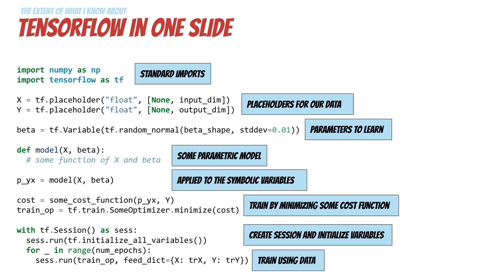
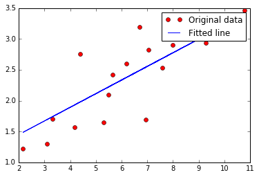

## Sections

- [Introduction to Deep Learning with TensorFlow](#introduction-to-deep-learning-with-tensorflow)
    - [What is Deep Learning?](#what-is-deep-learning)
    - [What is TensorFlow](#What-is-TensorFlow)
    - [What is a Data Flow Graph](#what-is-a-data-flow-graph)
- [TensorFlow examples](#tensorflow-examples)
    - [Introduction](#introduction)
        - [Hello world](#hello-world)
        - [Basic Operations](#basic-operations)
    - [Basic Models](#basic-models)
        - [Nearest Neighbor](#nearest-neighbor)
        - [Linear Regression](#linear-regression)
        - [Logistic Regression](#logistic-regression)
    - [Neural Networks](#neural-networks)
        - [Multilayer Perceptron](#multilayer-perceptron)
        - [Convolutional Neural Network](#convolutional-neural-network)
        - [Recurrent Neural Network (LSTM)](#recurrent-neural-network-lstm)


<br>
<br>

# Introduction to Deep Learning with TensorFlow

[[back to top](#sections)]

## What is Deep Learning?

[[back to top](#sections)]

> <i>Deep learning is a particular kind of machine learning that achieves great power and flexibility by learning to represent the world as a nested hierarchy of concepts, with each concept defined in relation to simpler concepts, and more abstract representations computed in terms of less abstract ones.</i>

<div align="right">
  I. Goodfellow, Y. Bengio, and A. Courville, "Deep Learning." Book in preparation for MIT Press, 2016. <br>
  http://www.deeplearningbook.org/
</div>

#### Representation Learning

> <i>Use machine learning to discover not only the mapping from representation to output but also the representation itself. </i>

<div align="right">
  I. Goodfellow, Y. Bengio, and A. Courville, "Deep Learning." Book in preparation for MIT Press, 2016. <br>
  http://www.deeplearningbook.org/
</div>

<br>
<br>

## What is TensorFlow

[[back to top](#sections)]


> <i>TensorFlow™ is an open source software library for numerical computation using data flow graphs. Nodes in the graph represent mathematical operations, while the graph edges represent the multidimensional data arrays (tensors) communicated between them. The flexible architecture allows you to deploy computation to one or more CPUs or GPUs in a desktop, server, or mobile device with a single API. TensorFlow was originally developed by researchers and engineers working on the Google Brain Team within Google's Machine Intelligence research organization for the purposes of conducting machine learning and deep neural networks research, but the system is general enough to be applicable in a wide variety of other domains as well.</i>

+ A TensorFlow computation is described by a directed **graph**, which is composed of a set on **nodes**
+ Each node represents the instantiation of an **operation**
+ An **operation** represents an abstract computation (e.g., "matrix multiply", or "add")
+ Clients programs interact with the TensorFlow system by creating a **Session**
+ Computations represented as a dataflow graph where **tensors** flow along the graph edges

<br>
<br>

## What is a Data Flow Graph

[[back to top](#sections)]

> <i> Data flow graphs describe mathematical computation with a directed graph of nodes & edges. Nodes typically implement mathematical operations, but can also represent endpoints to feed in data, push out results, or read/write persistent variables. Edges describe the input/output relationships between nodes. These data edges carry dynamically-sized multidimensional data arrays, or tensors. The flow of tensors through the graph is where TensorFlow gets its name. Nodes are assigned to computational devices and execute asynchronously and in parallel once all the tensors on their incoming edges becomes available.</i>

<br>
<br>

# TensorFlow examples



[[back to top](#sections)]

## Introduction

[[back to top](#sections)]

### Hello world

[[back to top](#sections)]

+ [Session](https://www.tensorflow.org/versions/r0.10/get_started/basic_usage.html#launching-the-graph-in-a-session): TensorFlow 是在 session 中运行 computation graph
+ [Fetches](https://www.tensorflow.org/versions/r0.10/get_started/basic_usage.html#fetches): 在 session 中执行 run()， 可以 fetch 得到 operation 的结果


```python
# Simple hello world using TensorFlow
import tensorflow as tf


# Create a Constant op
# The op is added as a node to the default graph.
#
# The value returned by the constructor represents the output
# of the Constant op.

hello = tf.constant('Hello, TensorFlow!')

# Start tf session
sess = tf.Session()

# Run graph
print sess.run(hello)
```

    Hello, TensorFlow!


<br>
<br>

### Basic Operations

[[back to top](#sections)]


```python
import tensorflow as tf

# Basic constant operations
# The value returned by the constructor represents the output
# of the Constant op.
a = tf.constant(2)
b = tf.constant(3)

# Launch the default graph.
with tf.Session() as sess:
    print "a=2, b=3"
    print "Addition with constants: %i" % sess.run(a+b)
    print "Multiplication with constants: %i" % sess.run(a*b)
```

    a=2, b=3
    Addition with constants: 5
    Multiplication with constants: 6


+ [Feed](https://www.tensorflow.org/versions/r0.10/get_started/basic_usage.html#feeds): 在 sess.run() 中传入 feed_dict 参数可以向对应的节点喂入数据
+ placeholder 作为一个占位符，是数据输入的端点，必须要在 run() 中喂入数据


```python
# Basic Operations with variable as graph input
# The value returned by the constructor represents the output
# of the Variable op. (define as input when running session)
# tf Graph input
a = tf.placeholder(tf.int16)
b = tf.placeholder(tf.int16)
# placeholder 是信息输入的端点
# 在 sess 中通过 feed_dict 参数来喂入数据

# Define some operations
add = tf.add(a, b)
mul = tf.mul(a, b)
# 这里定义的操作是象征性的，sess.run 之后才会真正在内存中跑起来

# Launch the default graph.
with tf.Session() as sess:
    # Run every operation with variable input
    print "Addition with variables: %i" % sess.run(add, feed_dict={a: 2, b: 3})
    print "Multiplication with variables: %i" % sess.run(mul, feed_dict={a: 2, b: 3})
```

    Addition with variables: 5
    Multiplication with variables: 6


```python
# ----------------
# More in details:
# Matrix Multiplication from TensorFlow official tutorial

# Create a Constant op that produces a 1x2 matrix.  The op is
# added as a node to the default graph.
#
# The value returned by the constructor represents the output
# of the Constant op.
matrix1 = tf.constant([[3., 3.]])

# Create another Constant that produces a 2x1 matrix.
matrix2 = tf.constant([[2.],[2.]])

# Create a Matmul op that takes 'matrix1' and 'matrix2' as inputs.
# The returned value, 'product', represents the result of the matrix
# multiplication.
product = tf.matmul(matrix1, matrix2)

# To run the matmul op we call the session 'run()' method, passing 'product'
# which represents the output of the matmul op.  This indicates to the call
# that we want to get the output of the matmul op back.
#
# All inputs needed by the op are run automatically by the session.  They
# typically are run in parallel.
#
# The call 'run(product)' thus causes the execution of threes ops in the
# graph: the two constants and matmul.
#
# The output of the op is returned in 'result' as a numpy `ndarray` object.
with tf.Session() as sess:
    result = sess.run(product)
    print result
```

    [[ 12.]]


<br>
<br>

## Basic Models

### Linear Regression

[[back to top](#sections)]

[Variable](https://www.tensorflow.org/versions/r0.10/get_started/basic_usage.html#variables):
+ variable 是在计算图中可训练的量
+ 在 session 中必须先要初始化
+ name 参数可定义 variable 在 graph 中的名称


```python
import tensorflow as tf
import numpy as np
import matplotlib.pyplot as plt
%matplotlib inline
```


```python
# Parameters
learning_rate = 0.01
training_epochs = 1000
display_step = 100
```


```python
# Training Data
train_X = np.asarray([3.3,4.4,5.5,6.71,6.93,4.168,9.779,6.182,7.59,2.167,
                         7.042,10.791,5.313,7.997,5.654,9.27,3.1])
train_Y = np.asarray([1.7,2.76,2.09,3.19,1.694,1.573,3.366,2.596,2.53,1.221,
                         2.827,3.465,1.65,2.904,2.42,2.94,1.3])
n_samples = train_X.shape[0]
```


```python
# tf Graph Input
X = tf.placeholder("float")
Y = tf.placeholder("float")

# Set model weights
W = tf.Variable(np.random.randn(), name="weight")
b = tf.Variable(np.random.randn(), name="bias")
```


```python
# Construct a linear model
pred = tf.add(tf.mul(X, W), b)
```


```python
# Mean squared error
cost = tf.reduce_sum(tf.pow(pred-Y, 2))/(2*n_samples)
# Gradient descent
optimizer = tf.train.GradientDescentOptimizer(learning_rate).minimize(cost)
```


```python
# Initializing the variables
init = tf.initialize_all_variables() # 定义初始化操作
```


```python
# Launch the graph
with tf.Session() as sess:
    sess.run(init)  # variable 在 session 中必须先初始化

    # Fit all training data
    for epoch in range(training_epochs):
        for (x, y) in zip(train_X, train_Y):
            sess.run(optimizer, feed_dict={X: x, Y: y})  # 每 run 一次 optimizer， 进行一次梯度下降

        #Display logs per epoch step
        if (epoch+1) % display_step == 0:
            c = sess.run(cost, feed_dict={X: train_X, Y:train_Y})
            print "Epoch:", '%04d' % (epoch+1), "cost=", "{:.9f}".format(c), \
                "W=", sess.run(W), "b=", sess.run(b)

    print "Optimization Finished!"
    training_cost = sess.run(cost, feed_dict={X: train_X, Y: train_Y})
    print "Training cost=", training_cost, "W=", sess.run(W), "b=", sess.run(b), '\n'

    #Graphic display
    plt.plot(train_X, train_Y, 'ro', label='Original data')
    plt.plot(train_X, sess.run(W) * train_X + sess.run(b), label='Fitted line')
    plt.legend()
    plt.show()
```

    Epoch: 0050 cost= 0.104400784 W= 0.157368 b= 1.46493
    Epoch: 0100 cost= 0.101245113 W= 0.162853 b= 1.42547
    Epoch: 0150 cost= 0.098453194 W= 0.168012 b= 1.38836
    Epoch: 0200 cost= 0.095982887 W= 0.172864 b= 1.35345
    Epoch: 0250 cost= 0.093797326 W= 0.177427 b= 1.32062
    Epoch: 0300 cost= 0.091863610 W= 0.18172 b= 1.28975
    Epoch: 0350 cost= 0.090152740 W= 0.185757 b= 1.26071
    Epoch: 0400 cost= 0.088638850 W= 0.189554 b= 1.23339
    Epoch: 0450 cost= 0.087299488 W= 0.193125 b= 1.2077
    Epoch: 0500 cost= 0.086114518 W= 0.196483 b= 1.18354
    Epoch: 0550 cost= 0.085066028 W= 0.199641 b= 1.16082
    Epoch: 0600 cost= 0.084138311 W= 0.202612 b= 1.13945
    Epoch: 0650 cost= 0.083317406 W= 0.205406 b= 1.11935
    Epoch: 0700 cost= 0.082590967 W= 0.208034 b= 1.10044
    Epoch: 0750 cost= 0.081948124 W= 0.210505 b= 1.08266
    Epoch: 0800 cost= 0.081379279 W= 0.21283 b= 1.06594
    Epoch: 0850 cost= 0.080875866 W= 0.215017 b= 1.05021
    Epoch: 0900 cost= 0.080430366 W= 0.217073 b= 1.03542
    Epoch: 0950 cost= 0.080036096 W= 0.219007 b= 1.0215
    Epoch: 1000 cost= 0.079687178 W= 0.220826 b= 1.00842
    Optimization Finished!
    Training cost= 0.0796872 W= 0.220826 b= 1.00842





<br>
<br>

### Logistic Regression

[[back to top](#sections)]


```python
import tensorflow as tf

# Import MINST data
from tensorflow.examples.tutorials.mnist import input_data
mnist = input_data.read_data_sets("/tmp/data/", one_hot=True)
```

    Extracting /tmp/data/train-images-idx3-ubyte.gz
    Extracting /tmp/data/train-labels-idx1-ubyte.gz
    Extracting /tmp/data/t10k-images-idx3-ubyte.gz
    Extracting /tmp/data/t10k-labels-idx1-ubyte.gz


```python
# Parameters
learning_rate = 0.01
training_epochs = 25
batch_size = 100
display_step = 5

# tf Graph Input
x = tf.placeholder(tf.float32, [None, 784]) # mnist data image of shape 28*28=784
y = tf.placeholder(tf.float32, [None, 10]) # 0-9 digits recognition => 10 classes

# Set model weights
W = tf.Variable(tf.zeros([784, 10]))
b = tf.Variable(tf.zeros([10]))

# Construct model
pred = tf.nn.softmax(tf.matmul(x, W) + b) # Softmax

# Minimize error using cross entropy
cost = tf.reduce_mean(-tf.reduce_sum(y*tf.log(pred), reduction_indices=1))  # tf.reduce_mean 类似 np.mean()
# Gradient Descent
optimizer = tf.train.GradientDescentOptimizer(learning_rate).minimize(cost)

# Initializing the variables
init = tf.initialize_all_variables()
```


```python
# Launch the graph
with tf.Session() as sess:
    sess.run(init)

    # Training cycle
    for epoch in range(training_epochs):
        avg_cost = 0.
        total_batch = int(mnist.train.num_examples/batch_size)
        # Loop over all batches
        for i in range(total_batch):
            batch_xs, batch_ys = mnist.train.next_batch(batch_size)
            # Fit training using batch data
            _, c = sess.run([optimizer, cost], feed_dict={x: batch_xs,
                                                          y: batch_ys})
            # Compute average loss
            avg_cost += c / total_batch
        # Display logs per epoch step
        if (epoch+1) % display_step == 0:
            print "Epoch:", '%04d' % (epoch+1), "cost=", "{:.9f}".format(avg_cost)

    print "Optimization Finished!"

    # Test model
    correct_prediction = tf.equal(tf.argmax(pred, 1), tf.argmax(y, 1))
    # Calculate accuracy for 3000 examples
    accuracy = tf.reduce_mean(tf.cast(correct_prediction, tf.float32))
    print "Accuracy:", accuracy.eval({x: mnist.test.images[:3000], y: mnist.test.labels[:3000]})
```

    Epoch: 0005 cost= 0.465507779
    Epoch: 0010 cost= 0.392393045
    Epoch: 0015 cost= 0.362739271
    Epoch: 0020 cost= 0.345433382
    Epoch: 0025 cost= 0.333723887
    Optimization Finished!
    Accuracy: 0.888333


<br>
<br>

## Neural Networks

[[back to top](#sections)]

### Multilayer Perceptron

[[back to top](#sections)]


```python
# Import MINST data
from tensorflow.examples.tutorials.mnist import input_data
mnist = input_data.read_data_sets("/tmp/data/", one_hot=True)

import tensorflow as tf
```

    Extracting /tmp/data/train-images-idx3-ubyte.gz
    Extracting /tmp/data/train-labels-idx1-ubyte.gz
    Extracting /tmp/data/t10k-images-idx3-ubyte.gz
    Extracting /tmp/data/t10k-labels-idx1-ubyte.gz


```python
# Parameters
learning_rate = 0.001
training_epochs = 15
batch_size = 100
display_step = 5

# Network Parameters
n_hidden_1 = 256 # 1st layer number of features
n_hidden_2 = 256 # 2nd layer number of features
n_input = 784 # MNIST data input (img shape: 28*28)
n_classes = 10 # MNIST total classes (0-9 digits)

# tf Graph input
x = tf.placeholder("float", [None, n_input])
y = tf.placeholder("float", [None, n_classes])
```


```python
# Create model
def multilayer_perceptron(x, weights, biases):
    # Hidden layer with RELU activation
    layer_1 = tf.add(tf.matmul(x, weights['h1']), biases['b1'])
    layer_1 = tf.nn.relu(layer_1)
    # Hidden layer with RELU activation
    layer_2 = tf.add(tf.matmul(layer_1, weights['h2']), biases['b2'])
    layer_2 = tf.nn.relu(layer_2)
    # Output layer with linear activation
    out_layer = tf.matmul(layer_2, weights['out']) + biases['out']
    return out_layer
```


```python
# Store layers weight & bias
weights = {
    'h1': tf.Variable(tf.random_normal([n_input, n_hidden_1])),
    'h2': tf.Variable(tf.random_normal([n_hidden_1, n_hidden_2])),
    'out': tf.Variable(tf.random_normal([n_hidden_2, n_classes]))
}
biases = {
    'b1': tf.Variable(tf.random_normal([n_hidden_1])),
    'b2': tf.Variable(tf.random_normal([n_hidden_2])),
    'out': tf.Variable(tf.random_normal([n_classes]))
}

# Construct model
pred = multilayer_perceptron(x, weights, biases)

# Define loss and optimizer
cost = tf.reduce_mean(tf.nn.softmax_cross_entropy_with_logits(pred, y))
optimizer = tf.train.AdamOptimizer(learning_rate=learning_rate).minimize(cost)

# Initializing the variables
init = tf.initialize_all_variables()
```


```python
# Launch the graph
with tf.Session() as sess:
    sess.run(init)

    # Training cycle
    for epoch in range(training_epochs):
        avg_cost = 0.
        total_batch = int(mnist.train.num_examples/batch_size)
        # Loop over all batches
        for i in range(total_batch):
            batch_x, batch_y = mnist.train.next_batch(batch_size)
            # Run optimization op (backprop) and cost op (to get loss value)
            _, c = sess.run([optimizer, cost], feed_dict={x: batch_x,
                                                          y: batch_y})
            # Compute average loss
            avg_cost += c / total_batch
        # Display logs per epoch step
        if epoch % display_step == 0:
            print "Epoch:", '%04d' % (epoch+1), "cost=", \
                "{:.9f}".format(avg_cost)
    print "Optimization Finished!"

    # Test model
    correct_prediction = tf.equal(tf.argmax(pred, 1), tf.argmax(y, 1))
    # Calculate accuracy
    accuracy = tf.reduce_mean(tf.cast(correct_prediction, "float"))
    print "Accuracy:", accuracy.eval({x: mnist.test.images, y: mnist.test.labels})
```

    Epoch: 0001 cost= 166.660608705
    Epoch: 0006 cost= 9.265776215
    Epoch: 0011 cost= 2.211729868
    Optimization Finished!
    Accuracy: 0.9434


<br>
<br>

### Convolutional Neural Network

[[back to top](#sections)]


```python
import tensorflow as tf

# Import MNIST data
from tensorflow.examples.tutorials.mnist import input_data
mnist = input_data.read_data_sets("/tmp/data/", one_hot=True)
```

    Extracting /tmp/data/train-images-idx3-ubyte.gz
    Extracting /tmp/data/train-labels-idx1-ubyte.gz
    Extracting /tmp/data/t10k-images-idx3-ubyte.gz
    Extracting /tmp/data/t10k-labels-idx1-ubyte.gz


```python
# Parameters
learning_rate = 0.001
training_iters = 200000
batch_size = 128
display_step = 200

# Network Parameters
n_input = 784 # MNIST data input (img shape: 28*28)
n_classes = 10 # MNIST total classes (0-9 digits)
dropout = 0.75 # Dropout, probability to keep units

# tf Graph input
x = tf.placeholder(tf.float32, [None, n_input])
y = tf.placeholder(tf.float32, [None, n_classes])
keep_prob = tf.placeholder(tf.float32) #dropout (keep probability)
```


```python
# Create some wrappers for simplicity
def conv2d(x, W, b, strides=1):
    # Conv2D wrapper, with bias and relu activation
    x = tf.nn.conv2d(x, W, strides=[1, strides, strides, 1], padding='SAME')
    x = tf.nn.bias_add(x, b)
    return tf.nn.relu(x)


def maxpool2d(x, k=2):
    # MaxPool2D wrapper
    return tf.nn.max_pool(x, ksize=[1, k, k, 1], strides=[1, k, k, 1],
                          padding='SAME')


# Create model
def conv_net(x, weights, biases, dropout):
    # Reshape input picture
    x = tf.reshape(x, shape=[-1, 28, 28, 1])

    # Convolution Layer
    conv1 = conv2d(x, weights['wc1'], biases['bc1'])
    # Max Pooling (down-sampling)
    conv1 = maxpool2d(conv1, k=2)

    # Convolution Layer
    conv2 = conv2d(conv1, weights['wc2'], biases['bc2'])
    # Max Pooling (down-sampling)
    conv2 = maxpool2d(conv2, k=2)

    # Fully connected layer
    # Reshape conv2 output to fit fully connected layer input
    fc1 = tf.reshape(conv2, [-1, weights['wd1'].get_shape().as_list()[0]])
    fc1 = tf.add(tf.matmul(fc1, weights['wd1']), biases['bd1'])
    fc1 = tf.nn.relu(fc1)
    # Apply Dropout
    fc1 = tf.nn.dropout(fc1, dropout)

    # Output, class prediction
    out = tf.add(tf.matmul(fc1, weights['out']), biases['out'])
    return out
```


```python
# Store layers weight & bias
weights = {
    # 5x5 conv, 1 input, 32 outputs
    'wc1': tf.Variable(tf.random_normal([5, 5, 1, 32])),
    # 5x5 conv, 32 inputs, 64 outputs
    'wc2': tf.Variable(tf.random_normal([5, 5, 32, 64])),
    # fully connected, 7*7*64 inputs, 1024 outputs
    'wd1': tf.Variable(tf.random_normal([7*7*64, 1024])),
    # 1024 inputs, 10 outputs (class prediction)
    'out': tf.Variable(tf.random_normal([1024, n_classes]))
}

biases = {
    'bc1': tf.Variable(tf.random_normal([32])),
    'bc2': tf.Variable(tf.random_normal([64])),
    'bd1': tf.Variable(tf.random_normal([1024])),
    'out': tf.Variable(tf.random_normal([n_classes]))
}

# Construct model
pred = conv_net(x, weights, biases, keep_prob)

# Define loss and optimizer
cost = tf.reduce_mean(tf.nn.softmax_cross_entropy_with_logits(pred, y))
optimizer = tf.train.AdamOptimizer(learning_rate=learning_rate).minimize(cost)

# Evaluate model
correct_pred = tf.equal(tf.argmax(pred, 1), tf.argmax(y, 1))
accuracy = tf.reduce_mean(tf.cast(correct_pred, tf.float32))

# Initializing the variables
init = tf.initialize_all_variables()
```


```python
# Launch the graph
with tf.Session() as sess:
    sess.run(init)
    step = 1
    # Keep training until reach max iterations
    while step * batch_size < training_iters:
        batch_x, batch_y = mnist.train.next_batch(batch_size)
        # Run optimization op (backprop)
        sess.run(optimizer, feed_dict={x: batch_x, y: batch_y,
                                       keep_prob: dropout})
        if step % display_step == 0:
            # Calculate batch loss and accuracy
            loss, acc = sess.run([cost, accuracy], feed_dict={x: batch_x,
                                                              y: batch_y,
                                                              keep_prob: 1.})
            print "Iter " + str(step*batch_size) + ", Minibatch Loss= " + \
                  "{:.6f}".format(loss) + ", Training Accuracy= " + \
                  "{:.5f}".format(acc)
        step += 1
    print "Optimization Finished!"

    # Calculate accuracy for 256 mnist test images
    print "Testing Accuracy:", \
        sess.run(accuracy, feed_dict={x: mnist.test.images[:256],
                                      y: mnist.test.labels[:256],
                                      keep_prob: 1.})
```

    Iter 25600, Minibatch Loss= 1453.969238, Training Accuracy= 0.87500
    Iter 51200, Minibatch Loss= 0.000000, Training Accuracy= 1.00000
    Iter 76800, Minibatch Loss= 836.579651, Training Accuracy= 0.91406
    Iter 102400, Minibatch Loss= 265.563293, Training Accuracy= 0.96875
    Iter 128000, Minibatch Loss= 120.997910, Training Accuracy= 0.99219
    Iter 153600, Minibatch Loss= 29.434311, Training Accuracy= 0.97656
    Iter 179200, Minibatch Loss= 248.191101, Training Accuracy= 0.98438
    Optimization Finished!
    Testing Accuracy: 0.984375


<br>
<br>

### Recurrent Neural Network LSTM

[[back to top](#sections)]


```python
import tensorflow as tf
from tensorflow.python.ops import rnn, rnn_cell
import numpy as np

# Import MINST data
from tensorflow.examples.tutorials.mnist import input_data
mnist = input_data.read_data_sets("/tmp/data/", one_hot=True)
```

    Extracting /tmp/data/train-images-idx3-ubyte.gz
    Extracting /tmp/data/train-labels-idx1-ubyte.gz
    Extracting /tmp/data/t10k-images-idx3-ubyte.gz
    Extracting /tmp/data/t10k-labels-idx1-ubyte.gz


```python
# Parameters
learning_rate = 0.001
training_iters = 100000
batch_size = 128
display_step = 100

# Network Parameters
n_input = 28 # MNIST data input (img shape: 28*28)
n_steps = 28 # timesteps
n_hidden = 128 # hidden layer num of features
n_classes = 10 # MNIST total classes (0-9 digits)

# tf Graph input
x = tf.placeholder("float", [None, n_steps, n_input])
y = tf.placeholder("float", [None, n_classes])

# Define weights
weights = {
    'out': tf.Variable(tf.random_normal([n_hidden, n_classes]))
}
biases = {
    'out': tf.Variable(tf.random_normal([n_classes]))
}
```


```python
def RNN(x, weights, biases):

    # Prepare data shape to match `rnn` function requirements
    # Current data input shape: (batch_size, n_steps, n_input)
    # Required shape: 'n_steps' tensors list of shape (batch_size, n_input)

    # Permuting batch_size and n_steps
    x = tf.transpose(x, [1, 0, 2])
    # Reshaping to (n_steps*batch_size, n_input)
    x = tf.reshape(x, [-1, n_input])
    # Split to get a list of 'n_steps' tensors of shape (batch_size, n_input)
    x = tf.split(0, n_steps, x)

    # Define a lstm cell with tensorflow
    lstm_cell = rnn_cell.BasicLSTMCell(n_hidden, forget_bias=1.0, state_is_tuple=True)

    # Get lstm cell output
    outputs, states = rnn.rnn(lstm_cell, x, dtype=tf.float32)

    # Linear activation, using rnn inner loop last output
    return tf.matmul(outputs[-1], weights['out']) + biases['out']

pred = RNN(x, weights, biases)

# Define loss and optimizer
cost = tf.reduce_mean(tf.nn.softmax_cross_entropy_with_logits(pred, y))
optimizer = tf.train.AdamOptimizer(learning_rate=learning_rate).minimize(cost)

# Evaluate model
correct_pred = tf.equal(tf.argmax(pred,1), tf.argmax(y,1))
accuracy = tf.reduce_mean(tf.cast(correct_pred, tf.float32))

# Initializing the variables
init = tf.initialize_all_variables()
```


```python
# Launch the graph
with tf.Session() as sess:
    sess.run(init)
    step = 1
    # Keep training until reach max iterations
    while step * batch_size < training_iters:
        batch_x, batch_y = mnist.train.next_batch(batch_size)
        # Reshape data to get 28 seq of 28 elements
        batch_x = batch_x.reshape((batch_size, n_steps, n_input))
        # Run optimization op (backprop)
        sess.run(optimizer, feed_dict={x: batch_x, y: batch_y})
        if step % display_step == 0:
            # Calculate batch accuracy
            acc = sess.run(accuracy, feed_dict={x: batch_x, y: batch_y})
            # Calculate batch loss
            loss = sess.run(cost, feed_dict={x: batch_x, y: batch_y})
            print "Iter " + str(step*batch_size) + ", Minibatch Loss= " + \
                  "{:.6f}".format(loss) + ", Training Accuracy= " + \
                  "{:.5f}".format(acc)
        step += 1
    print "Optimization Finished!"

    # Calculate accuracy for 128 mnist test images
    test_len = 128
    test_data = mnist.test.images[:test_len].reshape((-1, n_steps, n_input))
    test_label = mnist.test.labels[:test_len]
    print "Testing Accuracy:", \
        sess.run(accuracy, feed_dict={x: test_data, y: test_label})
```

    Iter 12800, Minibatch Loss= 0.716396, Training Accuracy= 0.75000
    Iter 25600, Minibatch Loss= 0.367348, Training Accuracy= 0.87500
    Iter 38400, Minibatch Loss= 0.164333, Training Accuracy= 0.92969
    Iter 51200, Minibatch Loss= 0.143476, Training Accuracy= 0.92969
    Iter 64000, Minibatch Loss= 0.193304, Training Accuracy= 0.96094
    Iter 76800, Minibatch Loss= 0.202645, Training Accuracy= 0.90625
    Iter 89600, Minibatch Loss= 0.056868, Training Accuracy= 0.98438
    Optimization Finished!
    Testing Accuracy: 0.992188


## 使用卷积神经网络做文本分类


```python
from os import path
import os
import re
import codecs
import pandas as pd
import numpy as np
```


```python
from cPickle import dump,load
#dump(df, open('data/tmdf.pickle', 'wb'))
df = load(open('data/tmdf.pickle','rb'))
```


```python
df.head()
```


<div>
<table border="1" class="dataframe">
  <thead>
    <tr style="text-align: right;">
      <th></th>
      <th>label</th>
      <th>txt</th>
      <th>seg_word</th>
    </tr>
  </thead>
  <tbody>
    <tr>
      <th>0</th>
      <td>0</td>
      <td>本报记者陈雪频实习记者唐翔发自上海\r\n　　一家刚刚成立两年的网络支付公司，它的目标是...</td>
      <td>本报记者 陈雪频 实习 记者 唐翔 发自 上海 \r\n 　 　 一家 刚刚 成立 ...</td>
    </tr>
    <tr>
      <th>1</th>
      <td>0</td>
      <td>证券通：百联股份未来5年有能力保持高速增长\r\n\r\n    深度报告 权威内参...</td>
      <td>证券 通 ： 百联 股份 未来 5 年 有 能力 保持高速 增长 \r\n ...</td>
    </tr>
    <tr>
      <th>2</th>
      <td>0</td>
      <td>5月09日消息快评\r\n\r\n    深度报告 权威内参 来自“证券通”www....</td>
      <td>5 月 09 日 消息 快评 \r\n \r\n         深度 报告...</td>
    </tr>
    <tr>
      <th>3</th>
      <td>0</td>
      <td>5月09日消息快评\r\n\r\n    深度报告 权威内参 来自“证券通”www....</td>
      <td>5 月 09 日 消息 快评 \r\n \r\n         深度 报告...</td>
    </tr>
    <tr>
      <th>4</th>
      <td>0</td>
      <td>5月09日消息快评\r\n\r\n    深度报告 权威内参 来自“证券通”www....</td>
      <td>5 月 09 日 消息 快评 \r\n \r\n         深度 报告...</td>
    </tr>
  </tbody>
</table>
</div>


```python
#  文本整理完毕，后面建模需要将词汇转成数字编号，可以人工转，也可以让keras转
textraw = df.seg_word.values.tolist()
textraw = [line.encode('utf-8') for line in textraw] # 需要存为str才能被keras使用
```


```python
maxfeatures = 50000 # 只选择最重要的词
from keras.preprocessing.text import Tokenizer
token = Tokenizer(nb_words=maxfeatures)
token.fit_on_texts(textraw) #如果文本较大可以使用文本流
text_seq = token.texts_to_sequences(textraw)
```


```python
np.median([len(x) for x in text_seq]) #  每条新闻平均400个词汇
```


    498.0


```python
y = df.label.values # 定义好标签
nb_classes = len(np.unique(y))
print(nb_classes)
```

    9


```python
from __future__ import absolute_import
from keras.optimizers import RMSprop
from keras.preprocessing import sequence
from keras.models import Sequential
from keras.layers.core import Dense, Dropout, Activation, Flatten
from keras.layers.embeddings import Embedding
from keras.layers.convolutional import Convolution1D, MaxPooling1D
from keras.layers.recurrent  import SimpleRNN, GRU, LSTM
from keras.callbacks import EarlyStopping
```


```python
maxlen = 600 # 定义文本最大长度
batch_size = 32 # 批次
word_dim = 100 # 词向量维度
nb_filter = 200  # 卷积核个数
filter_length = 10 # 卷积窗口大小
hidden_dims = 50  # 隐藏层神经元个数
nb_epoch = 10      # 训练迭代次数
pool_length = 50   # 池化窗口大小
```


```python
from sklearn.cross_validation import train_test_split
train_X, test_X, train_y, test_y = train_test_split(text_seq, y , train_size=0.8, random_state=1)

```


```python
# 转为等长矩阵，长度为maxlen
print("Pad sequences (samples x time)")
X_train = sequence.pad_sequences(train_X, maxlen=maxlen,padding='post', truncating='post')
X_test = sequence.pad_sequences(test_X, maxlen=maxlen,padding='post', truncating='post')
print('X_train shape:', X_train.shape)
print('X_test shape:', X_test.shape)
```

    Pad sequences (samples x time)
    ('X_train shape:', (14328, 600))
    ('X_test shape:', (3582, 600))


```python
# 将y的格式展开成one-hot
from keras.utils import np_utils
Y_train = np_utils.to_categorical(train_y, nb_classes)
Y_test = np_utils.to_categorical(test_y, nb_classes)
```


```python
# for version bug
import tensorflow as tf
tf.python.control_flow_ops = tf
```


```python
# CNN 模型
print('Build model...')
model = Sequential()

# 词向量嵌入层，输入：词典大小，词向量大小，文本长度
model.add(Embedding(maxfeatures, word_dim,input_length=maxlen,dropout=0.25))
model.add(Convolution1D(nb_filter=nb_filter,
                        filter_length=filter_length,
                        border_mode="valid",
                        activation="relu"))
# 池化层
model.add(MaxPooling1D(pool_length=pool_length))
model.add(Flatten())
# 全连接层
model.add(Dense(hidden_dims))
model.add(Dropout(0.25))
model.add(Activation('relu'))
model.add(Dense(nb_classes))
model.add(Activation('softmax'))
model.compile(loss='categorical_crossentropy', optimizer='rmsprop',metrics=["accuracy"])

```

    Build model...


```python
earlystop = EarlyStopping(monitor='val_loss', patience=1, verbose=1)
result = model.fit(X_train, Y_train, batch_size=batch_size, nb_epoch=nb_epoch,
            validation_split=0.1, callbacks=[earlystop])

```

    /Users/xiaokai/anaconda/envs/tensorflow/lib/python2.7/site-packages/keras/models.py:603: UserWarning: The "show_accuracy" argument is deprecated, instead you should pass the "accuracy" metric to the model at compile time:
    `model.compile(optimizer, loss, metrics=["accuracy"])`
      warnings.warn('The "show_accuracy" argument is deprecated, '
    /Users/xiaokai/anaconda/envs/tensorflow/lib/python2.7/site-packages/tensorflow/python/ops/gradients.py:90: UserWarning: Converting sparse IndexedSlices to a dense Tensor of unknown shape. This may consume a large amount of memory.
      "Converting sparse IndexedSlices to a dense Tensor of unknown shape. "


    Train on 12895 samples, validate on 1433 samples
    Epoch 1/10
    12895/12895 [==============================] - 704s - loss: 1.4306 - val_loss: 0.5532
    Epoch 2/10
    12895/12895 [==============================] - 7724s - loss: 0.4912 - val_loss: 0.4273
    Epoch 3/10
    12895/12895 [==============================] - 765s - loss: 0.3511 - val_loss: 0.4003
    Epoch 4/10
    12895/12895 [==============================] - 807s - loss: 0.2571 - val_loss: 0.4114
    Epoch 5/10
    12864/12895 [============================>.] - ETA: 5s - loss: 0.1971 Epoch 00004: early stopping
    12895/12895 [==============================] - 2285s - loss: 0.1968 - val_loss: 0.4415


```python
score = earlystop.model.evaluate(X_test, Y_test, batch_size=batch_size)
print('Test score:', score)
classes = earlystop.model.predict_classes(X_test, batch_size=batch_size)
acc = np_utils.accuracy(classes, test_y) # 要用没有转换前的y
print('Test accuracy:', acc)
```

    3582/3582 [==============================] - 73s
    ('Test score:', 0.4292584941548252)
    3582/3582 [==============================] - 73s
    ('Test accuracy:', 0.89056393076493578)


```python

```
